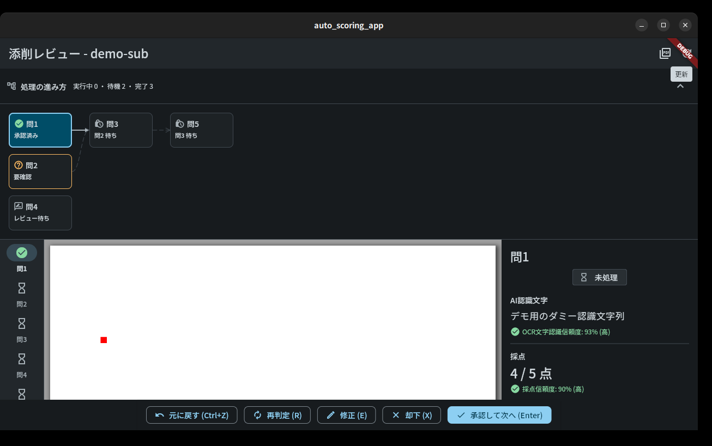
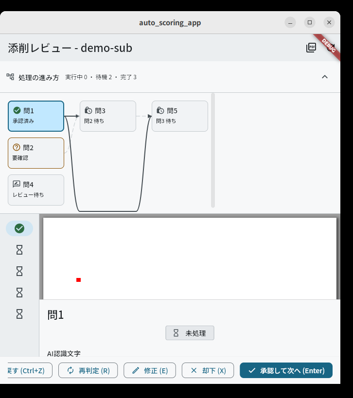

# 設問依存DAGによるAI処理の進捗表示

> **Issue #101 で画面が変わった。** 「答案取込画面」は 資料取込画面 (`/intake`) に
> 統合された。読み書きするものは変わっていない。
> 詳細は [`intake-and-settings.md`](./intake-and-settings.md)。

GitHub Issue [#64](https://github.com/HIKARU0627/Auto-Scoring/issues/64)（親
[#3](https://github.com/HIKARU0627/Auto-Scoring/issues/3)）。答案のAI処理中に
**何が今動いていて、何が何待ちで、次に何が始まるか**を、添削レビュー画面上の
ノードグラフとして見せる。

依存: [#26](https://github.com/HIKARU0627/Auto-Scoring/issues/26)（設問依存DAG本体、
[dependency-graph.md](./dependency-graph.md)）、
[#18](https://github.com/HIKARU0627/Auto-Scoring/issues/18)（ジョブキュー、
[job-queue.md](./job-queue.md)）、
[#66](https://github.com/HIKARU0627/Auto-Scoring/issues/66)（Riverpod / go_router）、
[#67](https://github.com/HIKARU0627/Auto-Scoring/issues/67)（デザイントークン、
[design-tokens.md](./design-tokens.md)）。

## 0. 何を作っていないか

この Issue で**新しく作ったものは表示だけ**である。

| 必要なもの             | どこに既にあるか                                                                               |
| ---------------------- | ---------------------------------------------------------------------------------------------- |
| 依存グラフ             | `DependencyGraph`（Issue #26）。`GET /tests/{id}/dependency-graph`                             |
| 並列実行レイヤー       | Kahn法。backend `domain.dependency_graph._kahn_layers`、Dart側はテスト設定画面が既に使っていた |
| ジョブ状態             | `Job.state` / `Job.usable` / `Job.blocked_on_question_id`（Issue #18）                         |
| データ取得・ポーリング | 添削レビュー画面が既に `listJobs` を3秒間隔で回している                                        |

**グラフ配置アルゴリズムは書いていない。** レイヤーが「x方向の位置」を、レイヤー内の
並び順が「y方向の位置」を、それぞれそのまま決める。ノードの座標計算は
`AppLayout.dagNodeWidth` などのトークンとの掛け算だけである。唯一の例外は、層を
飛ぶエッジがノードの裏を通らないようにする回避レーン（§1.10）で、これも
「ふさがれているエッジに、下から順に空きレーンを1本ずつ割り当てる」だけである。

## 1. 決定事項

### 1.1 描画ライブラリを追加しない（`CustomPainter` で足りる）

ノードグラフのライブラリ（`graphview`、`flutter_flow_chart` 等）は**採用しない**。

- グラフ描画ライブラリの主な価値は**レイアウトアルゴリズム**（力学モデル、Sugiyama法
  など「どこにノードを置くか」）である。ここではその答えが Issue #26 の並列実行
  レイヤーとして既に確定しており、しかもそれは見た目の都合ではなく
  **実際の実行計画そのもの**である。ライブラリに置き直させると、画面が示す構造と
  キューが実際に走らせる順序が別々に決まることになる。
- 残る仕事は「線と矢印を引く」だけで、`CustomPainter` の範囲。
- ノードは `CustomPainter` ではなく**通常のウィジェット**（`InkWell` +
  `Semantics`）にしてある。`CustomPaint` はフォーカス機構にもスクリーンリーダーにも
  「1個の不透明な要素」に見えるため、キーボード操作とアクセシビリティラベルという
  受入条件をどちらも満たせない。線だけを描かせ、ノードはウィジェットに任せている。

再検討の条件: レイヤー内のノード数が実データで十分多くなり、交差の削減
（barycenter法など）が読みやすさに効くと分かったとき。

### 1.2 レイアウト計算と状態導出は `core` に置く

`app/lib/core/dependency_dag.dart`。`features` 側（
`app/lib/features/pdf_review/dependency_dag_panel.dart`）は描画と入力だけを持つ。
既存の `core/pdf_review_geometry.dart` と同じ分け方で、検証は
`app/test/dependency_dag_test.dart`（ウィジェットツリー無し）。

> **Issue #84 で状態導出だけ切り出した。** `DagNodeStatus` と
> `deriveDagNodeStatus` は `core/question_status.dart` に
> `QuestionStatus` / `deriveQuestionStatus` として移り、左レールと右パネルも
> そこを読む。DAG専用の名前のまま3箇所で使うと、また別の語彙が生える。
> `dependency_dag.dart` に残るのはレイアウト計算と、パネル固有のヘッダ要約
> （`DagNodeProgress`）である。

副作用として、テスト設定画面（`test_settings_page.dart`）が持っていた
`_computeLayers` は `dependencyExecutionLayers` として `core` に移った。同じ計算が
2画面に別々に存在する状態を作らないため。

### 1.3 ノードの状態は「キューが先、人間が後」

1ノードに出す状態は1つだけなので、`Job.state`（queued / running / blocked /
succeeded / failed / cancelled）と `Review.action`（approved / modified / rejected /
regrade_requested）を `QuestionStatus` へ畳む。優先順位は**動いているジョブが常に
勝つ**。

理由: **動いている**ジョブは常にレビューより**新しい試行**を表す。新しい確定グラフ
versionでの再投入や再判定要求は新しい `Job` を作るが、追記専用のレビュー履歴には
前回の試行への承認が残ったままである（Issue #18）。走り直している設問に「承認済み」
と出すのは、起きていることの逆を言うことになる。

`succeeded` かつ `usable == false` **かつ、その設問を待っている `Job` が実在する**
ときに **要確認**（`AppStatusTone.attention`）にしている。これは「まだ誰も
レビューしていない」より強い主張で、キュー自身が「この結果では下流を解放しない」と
判断し、しかも実際に下流が止まっている状態だからである
（[job-queue.md](./job-queue.md)）。アプリ唯一の高彩度色をここに使うのは、
**下流が止まっていて、人間が見るまで動かない**という、まさに人を呼んでいる状態
だからである。

> **更新（決定・Issue #156）: `usable == false` だけでは要確認にしない。**
> 待っている設問が1つも無ければ `graded`（レビュー待ち）である。
>
> 理由は `Job.usable` が答えている問いにある。
> [ai-grading-pipeline.md](./ai-grading-pipeline.md)「Confidence閾値」がそれを
> 明記している ——「`Job.usable`が制御するのは「この設問を人間が見なくてよいか」
> ではなく「後続の依存設問へ進んでよいか」である」。**画面はこれを前者として
> 読んでいた。**
>
> 実測（実機再検証 #4、8教科）:
>
> |                                       |   実測 |
> | ------------------------------------- | -----: |
> | AI採点が付いた設問                    |     12 |
> | `usable == false`（＝要確認が立った） | **11** |
> | その実行の**依存エッジの総数**        |  **0** |
>
> **11件は1つも下流を止めていない。** 依存を持たない設問にとって
> 「下流を解放しなかった」は人へ向けた主張にならず、その設問は他の採点済みと
> まったく同じ状態 —— 終わっていて、人の確定を待っている —— にある
> （簡易設計書 §25.2「確定は人の仕事」）。**常時点いている旗は、旗として
> 働かない。** 実機再検証 #3 のデータでも依存エッジは 0 本で、2回の実行を
> あわせて確定済みグラフ 21 件・設問 92 件に**エッジは1本も無かった**。
>
> **事実そのものは失われない。** 「下流を解放しなかった」は §1.4 のとおり
> DAG のエッジが描き、旗の元になった低い Recognition Confidence は
> インスペクタの `OCR文字認識信頼度` に数値として残る。**畳んだのは
> 重複した警告であって、情報ではない。**
>
> 判定材料は `Job.blocked_on_question_id`（グラフのエッジではなく、キューが
> 実際に止めている事実）。`deriveQuestionStatus` の `hasWaitingDependents`
> 引数が受け取る。**この Issue で backend の `usable` 判定は変えていない。**
> 依存の解放条件としては正しく働いており、誤読していたのは画面側である。

> **更新（Issue #118）: 止まったジョブについては、そのあとに記録された人の決定が
> 勝つ。** 上の理由は「ジョブが新しい試行を表す」ことに立っており、
> `failed` / `cancelled` / `succeeded かつ usable == false` の**停止した**ジョブは
> もう新しいものを何も表さない。そこへ人が採点を入れた（Issue #118 の
> 「点数を入力」、[review-edit-history.md](./review-edit-history.md) §3.1）あとも
> 「失敗」「要確認」と出し続けると、**答案そのものは `REVIEWED`（確認済み）なのに、
> DAG・レール・インスペクタの3箇所がそろって逆を言う**ことになり、
> §1.3 がこの関数を1箇所へ集約して防いだはずの食い違いがそのまま再発する。
> 判定は `Review.created_at` が `Job.created_at` より後かどうかで、
> §1.5 の「その依頼に応えたジョブか」と同じ問いの裏返しである。ジョブより
> **前**の決定（再提出が新しいジョブを作った場合）は従来どおりジョブが勝つ。

### 1.4 エッジの「解放済み」は `Job.usable` で判定する

`state == 'succeeded'` では判定しない。`SUCCEEDED` でも低Confidenceなら
`usable = false` で下流を解放せず、逆に `FAILED` でも人間が
`mark_question_usable` で解放した場合は `usable = true` になる
（[job-queue.md](./job-queue.md)）。`state` で描くと、まだ正しく `BLOCKED` の
ノードの隣に「満たされた依存」が描かれる。

### 1.5 「再判定待ち」は、その依頼に応えたジョブが出た時点で終わる

`regrade_requested` は承認・却下と違って**依頼**であり、それを閉じる行が無い
（差し替えの採点結果は新しい `GradeResult` として積まれ、新しい `Review` には
ならない）。review action をそのままノードの状態にすると、再判定ジョブが走って
いる間は `AI処理中`、成功した瞬間にまた `再判定待ち` に戻り、新しい採点結果が
画面に出ているのに永久にそこで固まる（レビュー1回目 P2）。

依頼に応えたかどうかは2つの手がかりのどちらかで判定する。`Review.regrade_job_id`
は依頼が作ったジョブそのものを名指すので通常はこれで確定し、2つの時計が一致する
ことにも依存しない。もう一方の「依頼より後に作られたジョブ」は、それ以外の理由で
走ったジョブ（新しいグラフversionでの再投入など）を拾う -- それもレビュアーが
却下した結果を出したジョブではない。

承認・却下には同じ扱いをしていない。これらは**依頼ではなく下された判断**であり、
「まだ応えられていない」という状態が存在しないためである。

### 1.6 レビュー状態は「取得済みのものだけ」反映する

添削レビュー画面は選択中の設問のレビュー履歴しか取得しない
(`_ensureReviewLoaded`)。未訪問の設問のノードは**パイプラインがどこまで進んだか**を
示し、その設問を開いた時点で人間の判断が乗る。

全設問のレビュー履歴を毎ポーリングで取ると「設問数 × 3秒に1回」のリクエストになり、
その対価は「まだ下されていない判断」の描き分けでしかない。

**この割り切りは3箇所で同じである**（Issue #84）。「NavigationRail が元から
持っていたのと同じ割り切り」と当初書いたが、それは正確ではなかった -- レールは
ジョブを見ておらず、`_reviews` にその設問が入っているかどうかだけを見ていたので、
未訪問の設問を状態に関わらず一律 `hourglass_empty` にしていた。いまは3箇所とも
`_questionStatus` を通るので、レビュー半分が欠けている範囲もまったく同じである。

### 1.7 確定済みグラフだけを描く

`POST /dependency-graph/analyze` は常に新しい DRAFT version を作り、サイドカーは
**最新version しか返さない**。登録後に再分析したテストでは、最新グラフは
「どのジョブも走ったことのないグラフ」になる。これを描くと、動いているパイプラインが
使っていない依存構造を見せることになるので、その場合は図の代わりに一行の注記を出す。

グラフが1つも無い（404）テストでは、パネルごと出さない。レビュアーの実作業
（認識文字・採点・承認）はグラフに依存しないので、ここでの404は画面のエラー状態に
してはいけない。

### 1.8 ポーリング条件を「選択中の設問」から「この答案のジョブ全部」へ広げた

従来 `_updatePolling` は選択中の設問が採点待ちかどうかだけを見ていた。この図の要点は
**自分が見ていない上流の設問が終わって、下流が解ける**ところなので、選択中の設問が
終わった瞬間に図が凍るのでは意味がない。`_anyJobInFlight`（終端状態でないジョブが
1つでもあるか）を条件に加えた。

### 1.9 「いま描いている構造が、ジョブが走っている構造か」で取り直す

確定済みグラフは不変なので、シェルと一緒に1回だけ取れば足りる -- **そのテストの
グラフが差し替わらない限りは。** テスト設定画面で新しいversionを確定すると、backend
はこの答案の未完了ジョブをキャンセルして新versionで再起票する（Issue #26）。
ポーリングは新しいジョブ状態を受け取るが、エッジと層は取得済みの古いままなので、
**あるversionの実行状態が別のversionの構造の上に描かれる**。依存方向を反転させた
場合、矢印と「問n 待ち」ラベルが真逆のことを言う（レビュー2回目 P2）。

**どのversionが有効かはジョブが正本である。** `Job` は確定済みグラフに対してしか
作られないので、ジョブが名乗る `dependency_graph_version` の最大値が、この画面が
描くべきversionである。どのジョブもversionを持たなければ比較対象が無く、取りに行く
先も無い。

そのうえで「取り直すべきか」は**キャッシュが最新の確定グラフか**で決める。当初は
「より大きいversionが現れたら」という条件だけだったが、それでは2つ取りこぼした
（レビュー3回目 P2）。

| キャッシュの状態 | 取り直す条件            | なぜ                                                                                                                                                                                                                                             |
| ---------------- | ----------------------- | ------------------------------------------------------------------------------------------------------------------------------------------------------------------------------------------------------------------------------------------------ |
| 無し（null）     | 常に                    | 一度きりの取得が一時的な通信エラーで落ちると、以後の再取得が全部抑止されていた。ジョブがversionを名乗っている＝確定グラフは存在するので、もう一度試す                                                                                            |
| 確定済み         | `version < ジョブ最大`  | 「どれか1つでも食い違ったら」ではない -- 再起票は古いジョブをCANCELLEDのまま残すので、その条件だと以後ずっと真になり毎ティック取り直してしまう                                                                                                   |
| DRAFT            | `version <= ジョブ最大` | `DependencyGraph.confirm` は**versionを上げない**。DRAFT v2 を確定しても v2 のままなので、「より大きい」を待つと永久に発火せず、パネルが未確定の注記から復帰しなかった。自分と同じversionのジョブが現れることが、そのDRAFTが確定された合図である |

DRAFT がジョブより**先**にいる場合（登録後に再分析した通常の状態）は取り直さない。
取り直しても同じDRAFTが返るだけである。

### 1.10 層を飛ぶエッジは、ふさがれているときだけ下のレーンを通る

`A → B`、`B → C` に加えて `A → C` があるのは正当なグラフで、3つが連続する層の
同じ行に並ぶと `A → C` は水平線になり、不透明な B のカードの裏を通って画面から
消える（レビュー1回目 P2）。

**当たり判定は「見逃しの無い保守的な判定」であって、厳密な交差判定ではない。**
直線経路として描く曲線は y について単調（両端の制御点が端点と同じ y を持つ）なので、
経路の縦の広がりは両端の y の間に収まる。したがって「間の層に、その帯と縦方向で
重なるカードがあるか」を見れば、**実際にカードを横切るエッジを取りこぼすことはない**。
逆は保証しない -- 帯と重なっていても、そのカードのxの範囲では曲線がまだそのyに
達しておらず、本当は当たらない場合がある。その場合は不要な迂回になる。

**この非対称は意図的である。** ふさがれていないのに迂回させても、線が少し遠回りに
なりパネルが少し高くなるだけである。ふさがれているのに直線のままにすると、依存と
その解放状態が画面から消える。**間違えるならこちら側で間違える。**

迂回経路のほうは y について単調ではない（レーンへの下降と復帰がある）。こちらが
カードに当たらない理由は単調性ではなく、**下降と復帰がどちらも層と層のあいだの
空白に収まる**ことによる。`DagMetrics.detourShoulder` が水平方向の張り出しを
`columnGap / 2` 以下に抑えるので、下降と復帰を合わせても始点の隣の空き列から先へは
出ない。横に長く走る平らな部分は、そもそも全ノード行より下のレーンにある。

隣接層のエッジは間にノードが無いので常に直線のままで、層を飛んでいても経路が空いて
いれば直線を保つ -- 読める線をわざわざ遠回りさせるのは損だからである。

レーンのy座標・張り出し量・キャンバスの拡張は `core`（`DagEdgeDetour` /
`DagMetrics.laneY` / `DagMetrics.detourShoulder` / `buildDependencyDagLayout`）が
決める。`features` 側は与えられたレーンを通る経路を描くだけで、どちらの形も端点で
水平に出入りするので矢尻の描き方は変わらない。

### 1.11 ジョブが1件も無い答案には「AI採点を開始」を出す（Issue #80）

このパネルは元々「まだジョブが作られていない答案は `未処理` だらけの図として、
これから走る計画を見せる」という扱いだった（§7 の未決事項）。Issue #80 で
**答案取込画面が取込直後に採点ジョブを起票するようになった**ので、通常はこの
状態を見ることが無くなった。それでも残る2つの場合がある。

- 起票そのものが失敗した答案（確定DAGが無い・古い ⇒ 409、通信断など）。
- **Issue #80 より前に取り込まれた答案。** これはアプリからは二度と起票されない。

どちらも、図を眺めていても永久に何も起きない。そこで **ジョブが0件のときだけ**、
図の上に「この答案のAI採点はまだ開始されていません」という一行と
「AI採点を開始」ボタンを出す。押すと `POST /submissions/{id}/jobs` を呼び、
成功したらジョブを取り直して図がそのまま動き出す。

- **0件のときだけ**にしてある。1件でもあれば起票は済んでおり、そこにボタンを
  置くと「押せばもう一度採点される」と読める（実際はidempotentで何も起きない）。
  再実行は設問単位の「再判定」と `POST /jobs/{id}/retry` の担当である。
- **確定グラフが無い/未確定でもボタンは出す。** グラフ未確定の注記
  （§1.7）は「図が描けない」ことしか言わず、採点が始まっていないことは言わない。
  そもそも 409 になる条件は注記の条件と一致しない（グラフは確定済みでも、
  テストの設問が増減していれば 409 になる）ので、注記の有無でボタンを塞ぐと
  塞ぎすぎと塞ぎ漏れが両方起きる。409 が返ればその理由を日本語で出す
  （[job-queue.md](./job-queue.md)「起票のタイミング」のエラー方針）。
- 起票の失敗はこの画面のエラー状態（`_shellError`）にしない。レビュアーの実作業は
  それでも続けられる — §1.7 の404を画面のエラーにしないのと同じ理由である。
- **404（答案が存在しない）のあとはボタンごと消す。** 再試行しても答えは変わらない。
  最初の実装は失敗時に文言だけを保持していたので、`finally` でボタンが復活し、
  「この答案が見つかりません」の真上から同じ要求を何度でも押せた
  （review round 1, P2-2）。文言と再試行可否は
  `core/grading_kickoff.dart` の `GradingKickoffFailure` が1つの値として持ち、
  答案取込画面とこの画面が同じものを読む。
- **ジョブ一覧を一度も読めていないときは出さない。** `listJobs` は失敗しても
  握り潰す設計（最後に読めた一覧を保つ）なので、ジョブが空なのは「作られて
  いない」からとは限らず、「取りに行けなかった」ときも空である。この2つを
  区別せずに「まだ開始されていません」と書くのは、知らないことの断定になる。
  読めたことがあるかどうかを別に持ち（`_jobsLoaded`）、読めた結果としての0件
  のときだけ出す。

### 1.12 設問ごとの結果キャッシュは「どのジョブ集合で読んだか」で失効させる（Issue #80）

添削レビュー画面は設問ごとに認識・採点・注釈・レビュー履歴をキャッシュする
（`_reviews`）。**このキャッシュが有効なのは、それを読んだときのジョブ集合の下だけ**
である。ジョブが動けば結果も変わりうるからで、変わるのは見ている設問だけではない。

ここは3回続けて同じ穴を開けた場所なので、直し方を残す。

1. ジョブは取り直すのに、採点結果を取り直していなかった（round 2）。
2. 選択中の設問は取り直すのに、**未選択の設問**を取り直していなかった（round 3）。
   起票前に問2を開いて空の結果をキャッシュし、問1へ戻って起票すると、問2は空の
   まま残る。`_isAwaitingGrade` が「終端ジョブ + 採点結果なし」を「待つものは無い」
   と読むので、再取得もポーリングも起きない。
3. 答案を切り替えたら（別の `submissionId` で同じ `State` が再利用されたら）
   前の答案のキャッシュが残る。

1 と 2 はどちらも「無効化の範囲を呼び出し側が決めていた」ことが原因である。
**範囲は呼び出し側ではなく、変化に気づく場所で決める。**

- `_PdfReviewPageState._jobsGeneration` を1つ持ち、`_refreshJobs` が**ジョブ集合の
  変化を観測したときだけ**加算する（`id:state:usable` の指紋で比較する。`RUNNING`
  のまま `updated_at` だけ進んでも結果は増えていないので、時刻は指紋に入れない）。
- `QuestionReviewState.jobsGeneration` に「どの世代で読んだか」を記録し、
  `_loadReview` は世代が古いキャッシュを再利用しない。
- したがって**起票・再判定・retry・グラフ再確定・ポーリング**のどれであっても、
  ジョブが変われば全設問のキャッシュが同時に失効する。呼び出し側に足し忘れる
  余地が無い。
- 3 はルータで `PdfReviewPage` に `ValueKey('pdf-review/<testId>/<submissionId>')`
  を付けて構造的に潰した。別の答案は別の `State` になる。

**この画面が持つキャッシュの棚卸し**（`_jobsGeneration` の docstring にも同じものを
書いてある）。失効させる必要があるのは `_reviews` だけである。

| キャッシュ                                  | 失効させるか | 理由                                                                                                               |
| ------------------------------------------- | ------------ | ------------------------------------------------------------------------------------------------------------------ |
| `_reviews`（設問ごとの結果）                | **する**     | ジョブの産物そのもの                                                                                               |
| `_jobs` / `_jobsLoaded` / `_gradingFailure` | しない       | 失効させる当の呼び出しが書き換える                                                                                 |
| `_dependencyGraph`                          | しない       | `_refreshJobs` の中で必要なら取り直す（§1.9）                                                                      |
| `_submission`                               | しない       | ポーリングと更新で毎回読み直す。採点は答案の `state` を動かさない（[home-dashboard.md](./home-dashboard.md) §3.1） |
| `_questions` / `_pdfBytes`                  | しない       | テストと答案PDFの性質で、処理では変わらない                                                                        |

### 1.13 `await` のあとに誰が中止するか（Issue #80、3度目の再発）

添削レビュー画面は非同期処理だらけで、レビュアーはいつでも画面を離れられる。
**「`await` のあとに `mounted` を見る」という規律が、このリポジトリで3回破られた。**

| Issue | 症状                                                                      |
| ----- | ------------------------------------------------------------------------- |
| #66   | Riverpod 移行時、`await` 後に破棄済み widget で `ref.read` → `StateError` |
| #64   | 画面離脱中の pending request（テスト名 `leaving the screen mid-request`） |
| #80   | 「AI採点を開始」の応答が、レビュアーが画面を離れたあとに返る              |

3回とも**未処理例外**になった。#80 の形が要点を一番よく表している:

```
_startGrading()            await startGrading(...)      ← ここで離脱
  └ _refreshJobsAndQuestion()
      └ _refreshJobs()     内部で mounted を見て早期return  ← 正しく振る舞う
      └ _loadReview()      呼び出し元は止まっていないので実行される → setState → 例外
```

**内側の関数が `mounted` を見ていても、呼び出し元は止まらない。** この非対称が
見落としの温床である。`_refreshJobs` 自体は何も間違っていなかった。

**決定（誰が中止の責任を持つか）。** 2段構えにする。

1. **`await` した関数が自分で止まる。** 画面の破棄を跨ぎうる `await` の直後は
   `mounted` を見てから先へ進む。呼び出し先が止まったかどうかに依存しない。
2. **そのうえで `setState` 自身が拒否する。** 1 は規律で、3回破られている。
   `_PdfReviewPageState` は素の `setState` を呼ばず `_setStateIfMounted` を通す。
   守り漏れの代償を「無駄な取得」に留め、**未処理例外にはしない**。

2 は 1 の代わりではない。破棄後の処理は依然として無駄だし、`Timer` や
コントローラ呼び出しはこの wrapper では守れない（だから `_updatePolling` は
自分で `mounted` を見る。破棄後に `Timer` を張ると、誰かが cancel するまで
死んだ State に向けて発火し続ける）。

**約束を検査する。** `app/test/mounted_after_await_lint_test.dart` が、この
ファイルに素の `setState(` が戻ってきたら落ちる。`architecture_test.dart` /
`design_tokens_lint_test.dart` と同じで、規約は何かが検査して初めて実在する。
離脱中に応答が返る再現テストは `Issue #80` グループの
`起票の応答待ちのあいだに画面を離れても落ちない`（`Completer` で応答を保留し、
画面を捨ててから成功させる）。

**Issue #80 で洗った `await` の一覧**（未防御だったものだけ）:
`_startGrading`（起票の応答後）、`_refreshJobsAndQuestion`（`_refreshJobs` の後）、
`_loadReview`（入口。複数の経路から `await` 越しに入る）、`_updatePolling`、
`_loadShell`（グラフとジョブの取得後）、`_performReviewAction` の `finally`。

### 1.14 失敗は、畳んでも消えないところに置く（Issue #86）

由来は [#71](https://github.com/HIKARU0627/Auto-Scoring/issues/71) の
5モデル独立評価（[ui-ux-multi-agent-evaluation.md](./ui-ux-multi-agent-evaluation.md)
§4.2）。静止画からの観察だったので、**まずコードで原因を特定した**。実測（直す前の
コードに調査用テストを当てたもの。問1・問2・問4 が並列、問3 は問2 待ち、問5 は
問3 待ちという Issue のスクリーンショットと同じ形）:

```text
要確認: summary="実行中 0 ・ 待機 2 ・ 完了 3"  q3="問2 待ち"  q5="問3 待ち"
失敗  : summary="実行中 0 ・ 待機 2 ・ 完了 3"  q3="問2 待ち"  q5="問3 待ち"
畳んだあと、画面に「失敗」の語: 0 箇所
```

**3つとも完全に同一だった。** 原因は3か所に分かれていた。

| 症状                         | 原因                                                                                                            |
| ---------------------------- | --------------------------------------------------------------------------------------------------------------- |
| 要約が同じ                   | `DagNodeProgressOf.progress` が `failed` も `needsCheck` も `settled`（完了）へ畳んでいた                       |
| 畳むと失敗が消える           | ヘッダが出すのはその要約だけで、失敗はノード側にしか無かった                                                    |
| 下流の「待ち」が区別できない | `QuestionStatus.labelWaitingFor` が前提の**設問番号だけ**を受け取り、その前提がどんな状態かを見ていなかった     |
| 理由と復旧手段が無い         | `DagQuestion` が `Job.last_error` / `Job.error_code` を受け取っていなかった（画面は取得済みなのに渡していない） |

#### 決定1: 「人が動くまで進まないもの」は、完了と別に数える

`失敗` と `要確認` が `DagNodeProgress` のバケツを1つずつ持つ。**共通の1つには
しない** —— この Issue が読み分けろと言っているのがまさにその2画面なので、
まとめると同じ文字列がひとつ上の階層で再生産される。

この2つだけ**1件以上のときにしか出さない**。0件のときに常時並べると、
§1.3 が一度払った授業料（`usable == false` を常に旗にしていたら、12件中11件で
立って旗として働かなくなった）をもう一度払うことになる。**残る3つ（実行中・待機・
完了）は0でも出す。**「実行中 0」は「まだ動いているのか」への答えだが、
「失敗 0」は問われていない問いへの答えである。

`中止` は `完了` に残した。中止は人か再提出が意図して止めたもので、再提出は同じ
処理の中で後継ジョブを作る（[job-queue.md](./job-queue.md)）。**何かを欲しがって
そこに居るジョブではない。**

#### 決定2: 下流のラベルは、**動ける設問**を名指す

`labelWaitingFor` は前提の状態も受け取る。

| 前提の状態 | ラベル         |
| ---------- | -------------- |
| 失敗       | 問2 失敗で停止 |
| 要確認     | 問2 確認待ち   |
| それ以外   | 問2 待ち       |

3つとも「問N」＋述語という同じ形で、違うのは語だけである。**どれも8文字以内**
にしてあるのは、`AppLayout.dagNodeWidth`(116) のノードが省略記号なしで収まる上限が
そこだからである。「問2 失敗で…」と切れたら、区別を付け直した意味が無い。

**辿る先は直前の前提ではなく、止まっている大元である。** 問5 は問3 待ち、問3 は
問2 待ちで、問2 が失敗している。「問3 待ち」と書くと問3 に何かできるように読める
が、問3 にできることは何も無い。人が動ける場所は問2 だけなので、問3 も問5 も
「問2 失敗で停止」と出す。**構造そのものは DAG のエッジが描いている**ので、遠い
ほうを名指しても失われる情報は無い。

上流がまだ `running` / `queued` なら従来どおり直前の前提を名指す。そちらは
**待っていれば本当に進む**からである。

辿るのは `Job.blocked_on_question_id` で、確定グラフのエッジではない
（§1.3 の `hasWaitingDependents` と同じ理由: キューが実際に止めている事実の
ほうを読む）。再起票の途中で古い行が残りうるので、`resolveQuestionWait` は
訪問済み集合で循環を止める —— ここで回るとフレームごと止まる。

**この決定は DAGパネルだけのものではない。** `labelWaitingFor` は左レールと
インスペクタのバッジも通る（Issue #84）。3箇所が同じ語を出す性質は
`pdf_review_page_test.dart` の Issue #84 グループが検査していて、変異させると
そこも赤くなることを確認した。

#### 決定3: 失敗の告知はヘッダに置く（＝折りたたみの外）

畳む目的はPDFビューアに縦を返すことなので、**図は消えてよい。失敗は消えてはいけない。**
ヘッダに出すのは3つ。

1. **どの設問が失敗し、何を止めているか** ——「問2 が失敗し、問3・問5 は人が対応する
   まで進みません。」 後半は件数では言えない部分で、**その答案を放置する代償**を
   言っているから、いま対処されるかどうかを分ける。
2. **理由と次の一手**（決定4）。
3. **そこへ行くボタン**（「問2 を開く」）。押すとその設問が選択され、インスペクタに
   診断文・再判定・点数を入力が揃う。**パネル自身は「再判定」ボタンを持たない** ——
   再判定が正しい手ではない失敗が実在する（決定4の `answerAreaWrong`）ので、無条件に
   置くと間違った手を勧めることになる。

#### 決定4: `Job.last_error` は画面に出さない。分類は `Job.error_code` を使う

`last_error` は provider 名・例外クラス名・HTTPステータス・内部の理由語を並べた
**診断文**である（`jobs/grading_processor.py` の `_failed`）。インスペクタは
これをそのまま出す —— 初回起動で 401 / 403 / 404 のどれで詰まっているかを区別する
ためで、Issue #97 review round 4 の決定である。**このパネルは違う問いに答えている**:
畳んでも残る一行で「誰かが手を入れるまで進まない」ことと「その手の入れ方」を言う
場所であって、診断文を置く場所ではない（AGENTS.md «Security»）。

分類には `Job.error_code`（backend の `domain.models.ErrorCategory`）を使う。
**すでに OpenAPI schema にも生成済みDartクライアントにも入っている**
（`JobResponse.errorCode`）ので、**schema は変更していない。**

| `error_code`                | 画面に出す文言の要点                                                    |
| --------------------------- | ----------------------------------------------------------------------- |
| （`crop_not_the_answer`）   | 渡された画像がこの設問の解答ではない ⇒ **テスト設定の「回答欄」を直す** |
| `rate_limited`              | AIの利用上限 ⇒ しばらく置いてから「再判定」                             |
| `timeout` / `server_error`  | 通信が通らず再試行の上限 ⇒ 「再判定」か「点数を入力」                   |
| `permanent`                 | 同じ設定では結果は変わらない ⇒ 教材とAI設定を見直すか「点数を入力」     |
| 無し / このビルドが知らない | どちらの出口も示す（新しい分類を言い当てない）                          |

`crop_not_the_answer` を `error_code` より先に見るのは、それが `PERMANENT` の
1つでありながら **`permanent` の一般的な出口（設定を見直す）では直らない**唯一の
ものだからである（Issue #136、`grading_processor._crop_is_not_the_answer`）。
再判定は同じ画像を同じモデルへ送り直すだけなので、勧めてはいけない。

**生の文字列がパネルに届かないことは、構造で担保している。** `DagQuestion` の
コンストラクタが `lastError` / `errorCode` を受け取って
`DagFailureGuidance` に畳み、**生の文字列は保持しない**。ノードにも要約にも
`last_error` を取り出す道が無い。規律ではなく型で止めている。

#### 何を変えていないか

- **確信度から完了を導いていない**（簡易設計書 §25.2）。この Issue は失敗を
  見せる話であって、自動承認の話ではない。`usable` の読み方（§1.3 の Issue #156）
  にも触れていない。
- **backend も OpenAPI schema も変えていない。** 必要な材料はすべて既存の
  `JobResponse` にあった。
- インスペクタの `_buildAiGradingFailedNotice`（診断文をそのまま出す）は
  そのまま。あそこは調べる場所で、ここは一目で見る場所である。

## 2. 配置と操作

- **PDFビューアと同じペインの上に置く**（Issue #85 で変更。当初は画面最上部の
  全幅バンドだった）。全幅バンドは Inspector からも同じだけ高さを奪うが、
  Inspector が持っているのは承認の判断材料そのものである。**進捗は文脈、
  判断材料は仕事**なので、バンドの負担はビューア側に寄せる。狭幅では Inspector が
  ビューアの下に積まれる＝同じペインなので、従来どおり分け合う。
  折りたたみ可能で、たたんでもヘッダに要約（§3）と**失敗の告知**（§1.14）が残る。
- **狭幅では縮小せずスクロールする。** ノードを縮めると設問番号と状態ラベルが
  読めなくなり、図の目的そのものが失われる。高さは
  `min(図の高さ, AppLayout.dagPanelHeight, ペインの高さ × dagPanelMaxHeightFraction)`
  で決め、中を縦横にスクロールさせる。1ノード行にも満たない高さしか割けないときは
  展開しない（トグルは消さずに無効化し、理由を tooltip に出す。消えるボタンは
  不具合に見える）。
- **幅が余るぶんは層間のギャップに回し、残りは中央に寄せる**（Issue #85）。
  3層の図の固有幅は約480pxで、1280pxの全幅バンドに左寄せすると右の3/5が空白に
  なっていた。ギャップの上限は `AppLayout.dagColumnGapSpreadLimit`。
- ノードのクリック / Enter / Space でその設問を選択する（既存の設問選択と同じ経路）。
- **フォーカスは見えること。** `InkWell` 自身のフォーカスハイライトは祖先の
  `Material` に描かれ、ノードカードの不透明な背景がその上に乗るので隠れてしまう。
  そのためカード自身の装飾に外向きのリングを描いている（レビュー2回目 P2）。
  枠線は「選択中」と「依存が解けた瞬間」に使っているので、フォーカスはそれとは別の
  形（カードの外側を囲むリング）にして、色ではなく位置で読めるようにしてある。
- **キーボード**: ← → でレイヤー間、↑ ↓ でレイヤー内を移動する。添削レビュー画面は
  ↑↓ を設問移動、Enter を「承認して次へ」に割り当てているので、パネルは自分の
  `Shortcuts` をフォーカスに近い位置に置いて、パネル内にフォーカスがある間だけ
  これらを奪う。移動そのものは Flutter の方向フォーカス
  （`DirectionalFocusIntent`）に任せており、ノードの実座標をそのまま使う。

## 3. 色に依存しない表現（Issue #25 の基準）

| 情報               | 形での表現                                        | 色での補強             |
| ------------------ | ------------------------------------------------- | ---------------------- |
| ノードの状態       | 状態ごとに固有のアイコン + 日本語ラベル           | `AppStatusTone`        |
| 何待ちか           | ラベルが「問1 待ち」と前提の設問番号を名指す      | —                      |
| その待ちが終わるか | 「問2 待ち」/「問2 確認待ち」/「問2 失敗で停止」  | —                      |
| 失敗と復旧手段     | ヘッダの1行（アイコン＋日本語＋名前のあるボタン） | `AppStatusTone.danger` |
| 依存が満たされたか | 未: 破線 + 開いた矢尻 / 済: 実線 + 塗り矢尻       | outlineVariant/outline |
| 依存の向き         | レイヤーが左→右、矢印も常に右向き                 | —                      |
| 実行中             | 下辺の2pxの動くハイライト                         | —                      |
| キーボード位置     | カードの外側を囲むリング                          | `colorScheme.primary`  |

`app/test/question_status_test.dart` が「全状態がそれぞれ固有のアイコンとラベルを
持つ」ことを検査する。この表は**DAGパネルだけの取り決めではない**（Issue #84）:
左レールと右パネルのバッジも同じ `QuestionStatus` から形と語を取るので、同じ設問に
ついて3箇所が同じアイコンと同じ日本語ラベルを出す。レールは幅が無いので語を
tooltip と semantics label に載せる。

ヘッダの要約は `DagNodeProgress` に落とす。バケツの合計は常にノード数に一致する
-- 以前は「未処理」がどれにも当たらず完了へ流れ込み、ジョブがまだ1つも作られて
いない答案を、畳んだパネルのヘッダが「全部完了」と報告していた
（レビュー1回目 P2）。

| バケツ | 何の数か                             | 常に出すか        |
| ------ | ------------------------------------ | ----------------- |
| 実行中 | いまAIが処理しているもの             | 出す（0でも）     |
| 待機   | これから動くもの                     | 出す（0でも）     |
| 要確認 | 人が確認するまで下流が進まないもの   | **1件以上のとき** |
| 失敗   | 人が対応するまで進まないもの         | **1件以上のとき** |
| 完了   | AI処理が終わり、人を待っていないもの | 出す（0でも）     |

**「完了」に 失敗・要確認 を入れていたのを Issue #86 でやめた。** 詳しくは §1.14。
各ラベルが何の数かは、要約の tooltip（`DependencyDagLayout.progressLegend`）が
全バケツぶん出す —— 0件で要約から消えているものも含めて。数字の単位を
聞かれるのは、今日の答えがゼロでも同じだからである。

## 4. モーション（[design-tokens.md](./design-tokens.md) §5 との関係）

デザイントークンの原則は「常時動くものを作らない」である。この画面はその原則の
**唯一の明示的な例外**を持つ。

- **一度だけ動くもの**: 依存が満たされた瞬間、そのエッジを前提→後続の向きに
  250ms（`AppMotion.emphasis`）で1回だけ走らせ、`blocked` が解けたノードの枠を
  同じ時間だけ強調して戻る。これが Issue #64 の主役である。
- **動き続けるもの**: `RUNNING` のノードの下辺だけにある2px
  （`AppLayout.activityBarHeight`）の低コントラストのバー。「今まさに処理中」は
  1回告知して止められる種類の情報ではないため。**実行中のノードにしか出ず、
  ジョブが `RUNNING` を離れた瞬間に消える。**
- **動かないもの**: それ以外の全ての状態変化。`実行待ち → AI処理中` も、人間の承認も、
  `AnimatedContainer`（150ms）でその場の色が変わるだけである。1時間見る画面で
  全ての状態変化に強調を付けるのは、design-tokens.md §5 が避けている疲労そのもの。
- OSで「視差効果を減らす」（`MediaQuery.disableAnimations`）が有効なときは、
  1回の告知も実行中バーの移動も行わない。情報はアイコンとラベルに載っているので
  落ちない。

## 5. スクリーンショット（Linux開発機、実アプリ）

いずれも**合成データ**である。テスト・設問・答案PDF（リポジトリ内の PoC 3 fixture
`app/test/fixtures/a4-portrait.pdf`）・認識文字・点数まで全て作り物で、実データは
一切写っていない。

> **この2枚は Issue #85 より前の配置である。** #85 でバンドを画面最上部の全幅から
> PDFビューア側のペインへ移し、高さを画面高に応じた上限にし、余った幅を層間へ
> 配ったので、**バンドの位置・幅・高さは写真と違う**。図そのもの（層の並び、
> 実線/破線、矢尻、状態ラベル）の読み方は変わっていない。撮り直しには任意の
> route・テーマ・ウィンドウサイズを指定できる `screenshot-linux-app.sh` が要り、
> それは Issue #71 の PR でまだ `main` に入っていないため、ここでは差し替えずに
> 差分を明記するに留めた。新しい配置は
> `app/test/pdf_review_page_test.dart` の Issue #85 受入グループが実寸で固定して
> いる。

### 5.1 desktop 標準幅（1280×720）



**同じ設問について、3箇所が同じ語とアイコンを出す**（Issue #84）。問1 は DAGノード・
左レール・右パネルのバッジのすべてが「承認済み」であり、AppBar の「答案: 要確認」は
**答案**の状態だと位置と語で名指している。左レールは設問ごとに違うアイコンを出す
（問2 は要確認、問3・問5 は前提待ち、問4 はレビュー待ち）。

読み方: 問1 と 問2 と 問4 は同じ層＝並列に走りうる。問1 は人間が承認済み、問2 は
`SUCCEEDED` だが `usable = false`（低Confidence）なので**下流を解放していない**。
その結果 問3 も、問3 に依存する 問5 も止まっている（**この2枚は Issue #86 より前
なので「問2 待ち」「問3 待ち」と写っている。いまは両方とも「問2 確認待ち」で、
人が動ける設問のほうを名指す** —— §1.14 決定2）。
問1 → 問3 のエッジだけが実線＋塗り矢尻（解放済み）で、問2 → 問3 と 問3 → 問5 は
破線＋開いた矢尻（未解放）。**この画面から「今は誰も動いていない。問2 を人が見る
まで何も進まない」が読める**というのが、この機能の目的そのものである。

問1 → 問5 は層を1つ飛ぶ依存で、下のレーンを回って 問5 に入っている（§1.10）。
まっすぐ引くと 問3 のカードの裏を通り、直接依存とその解放状態が画面から消える。

### 5.2 狭幅（700×720）



Inspector は PDF の下（Issue #21 の既存挙動）。パネルはノードを縮めず、入り切らない
分をスクロールに回す。**NavigationRail は狭幅でも設問番号を出す**（Issue #84。
以前はアイコンのみで、同じ絵が5個縦に並ぶだけだった）。

なお **`AI処理中` のノードとそのハイライト、および依存が解ける瞬間の告知は
静止画には写らない**ので、`app/test/dependency_dag_panel_test.dart` の
`only a running node moves, and it stops when the job does` /
`the moment an upstream finishes and the downstream is released is announced
once, then the diagram settles` が代わりに検査している。

## 6. 検証

- `app/test/dependency_dag_test.dart` — レイヤー分割、座標、状態導出、
  `usable` による解放判定、再判定依頼の解消、進捗バケツ、回避レーンの割り当てと
  張り出し量、色に依らない表現（ユニットテスト）。**Issue #86 のグループ**が
  要約の文字列・下流ラベルの解決（`resolveQuestionWait` の大元辿りと循環止め）・
  失敗の告知（止めている下流の一覧、生の `last_error` が残らないこと）を固定する。
- `app/test/dag_failure_guidance_test.dart` — `error_code` から文言への対応と、
  **返り値に `last_error` の断片が混ざらないこと**（Issue #86）。画面側の検査だけ
  だと「出す側が黙った」ときに空虚に通るので、両側から挟んでいる。
- `app/test/dependency_dag_panel_test.dart` — 描画・クリック・キーボードのみの操作・
  **フォーカスが見えること**・折りたたみ・狭幅スクロール・告知が1回で終わること・
  視差効果削減・ダークテーマ。**Issue #86 のグループ**が、要確認の画面と失敗の画面で
  ヘッダーの文字列が違うこと・畳んでも失敗が残ること・下流の「待ち」が上流の理由で
  変わること・失敗から理由と次の一手へ行けること・生の `last_error` が出ないこと・
  狭幅(700×720)＋ダーク＋キーボードのみで「問2 を開く」まで届くことを固定する。
- `app/test/pdf_review_page_test.dart` の `Issue #64` グループ — 実画面での結線
  （上流完了で下流がライブに解ける、**グラフ再確定で構造ごと差し替わる**、
  **同一versionのDRAFT確定から復帰する**、**初回のグラフ取得失敗から復帰する**、
  ノードから設問選択、未確定グラフ、グラフ無し）。
- `app/test/pdf_review_page_test.dart` の `Issue #80` グループ — §1.11 の
  「AI採点を開始」（ジョブ0件のときだけ出る、押すとジョブができて図が動き出す、
  409は画面のエラー状態にしない、404のあとはボタンを出さない、ジョブ一覧を
  読めていないときは何も断定しない）と、§1.12 のキャッシュ失効（起票のPOSTが
  既に終わったジョブを返しても採点結果を取り直す、**起票前に開いておいた別の
  設問も選び直せば結果が出る**）。

## 7. 未決事項

- レイヤー内の並び替えによる交差削減（§1.1）。実データの設問数を見てから。
- **未訪問の設問のレビュー状態**（§1.6）。一括取得のAPIができたら見直す。
  Issue #84 で左レールもここへ寄せたので、**この割り切りの影響範囲が3箇所に
  広がった**（DAGパネル・左レール・右パネルのバッジ）。ただし内容は変わって
  いない: パイプラインの状態は `listJobs` が答案全体ぶん返すので全設問について
  正しく、欠けるのは「未訪問の設問に対して人間が下した判断」だけである。
  実運用でここが問題になるのは、**別のセッションで承認済みの設問を含む答案を
  開き直したとき**に限られる。新しいAPIを足す判断はまだしていない。足すなら
  `GET /submissions/{id}/reviews`（答案1件ぶんの effective review 一覧）で、
  切り出し先は `backend/src/auto_scoring/api/review_router.py`。
- ~~ジョブがまだ作られていない答案（`未処理` だらけの図）の見せ方~~ — Issue #80 で
  決めた。図はそのまま「これから走る計画」として出し、ジョブが0件のときだけ
  「AI採点を開始」を添える（§1.11）。
