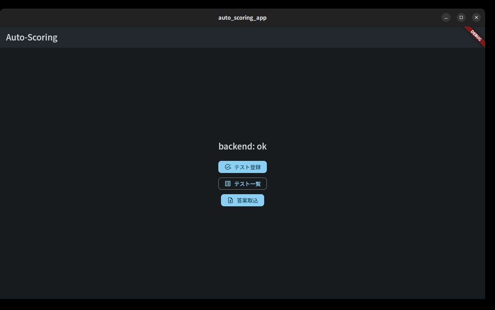
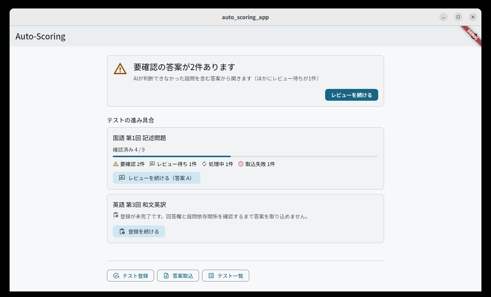

# ホーム画面

Issue #68。アプリを開いた瞬間に「**今どうなっていて、次に何をすればいいか**」が
分かる画面にするための決定を残す文書。対象は `app/lib/features/home/`。

画面そのものの位置づけは
[simplified-design-specification.md](./simplified-design-specification.md) §16.1、
寸法・配色の出どころは [design-tokens.md](./design-tokens.md)。

> **⚠ 一部の文言は Issue #95 の決定より前の前提で書かれている。**
> 決定 1 で**模範解答PDFは必須入力から外れ**（採点基準PDFに置き換え）、
> 決定 9 で**テスト登録と答案取込は 1 つの操作になった**ため、
> 「模範解答と採点マニュアルのPDFを登録すると答案を取り込めるようになります」という
> 導線の説明（§8.1）は**現行仕様と食い違う**。
> 現行仕様は [簡易設計書](./simplified-design-specification.md) §4・§6.3・§16.2 が正で、
> **この文言は作り直しが要る**。本書は実装当時の記録として残してある。

## 0. 何を捨てたか

Issue #68 以前のホームは79行で、中身は次の2つだけだった。

- 中央に `backend: ok` / `backend: unavailable` / `backend: checking…`
- 縦積みのボタン3つ（テスト登録 / テスト一覧 / 答案取込）

docstring 自身が `Confirms the app boots and can reach the (stubbed) backend`
と書いており、MVP初期の**起動確認用の足場**がそのまま残っていた。

**`backend: ok` は撤去した。** サイドカーの生死は Issue #24 の
`SidecarStartupOverlay` がアプリ全体を覆って扱っており、到達できなければ
そもそもホームは見えない。同じ判定を2箇所が別々に出すと、片方だけが古い
という状態が作れてしまう。

ボタン3つは残した（画面下部の入口行）。無くなると新規登録の導線が消えるが、
**上から順に読んだときに最後に来るべきもの**なので位置を下げた。

## 1. 変更前 / 変更後

同じ状態（合成データ）のサイドカーに対して、Linux 開発機で撮影した
（[linux-desktop-development.md](./linux-desktop-development.md) §4）。**写っている
テスト名・答案ラベルは合成のダミー**で、実在の答案データは含まない。

変更前 — 起動確認用の足場。デバッグ文字列とボタン3つで、作業状況は分からない。

変更後 — 「次の一手」1件と、テストごとの進み具合。

## 2. 画面の構造

上から順に、読む順序がそのまま優先順位になっている。

| 領域                    | 答えている問い                 | 中身                                                              |
| ----------------------- | ------------------------------ | ----------------------------------------------------------------- |
| 次の一手（1枚のカード） | 次に何をすればいいか           | 状況の見出し・理由・`FilledButton` 1つ                            |
| テストの進み具合        | 今どうなっているか             | テストごとに、確認済みの進捗バーと0件でない状態の内訳、再開ボタン |
| 入口行                  | 進行中の作業と関係なく要るもの | テスト登録 / 答案取込 / テスト一覧                                |

### 2.1 「次の一手」を1つに絞る理由

候補を3つ並べるとそれは結局ダッシュボードで、**選ぶ手間を画面から人間へ
戻す**ことになる。Issue #68 の「数字を並べるだけのダッシュボードにしない」は
そこを指している。全体像は下のテストカードが持っているので、一番上は
「今すぐ押すもの」1つでよい。

優先順位は `HomeDashboard.nextAction`（`home_dashboard.dart`）で決めており、
`app/test/home_dashboard_test.dart` が全分岐を固定している。

1. **要確認の答案**（`needs_review`）→ その1件の添削レビューへ
2. **レビュー待ちの答案**（`ai_processed`）→ 同上
3. **取込に失敗した答案**（`error`）→ 答案取込画面へ
4. **登録が途中のテスト**（`draft`）→ そのテスト設定画面へ
5. **処理中**（`unprocessed` / `ai_processing`）→ 行き先なし。「更新」だけ
6. テストはあるが片付いている → 答案取込画面へ
7. テストが1件も無い → テスト登録画面へ

**取込失敗をレビューより下に置いた**のが唯一迷った点である。失敗は放置すると
その生徒の答案が黙って欠けるので重い。それでも下にしたのは、一番上は
「中断した作業の続き」であるべきで、失敗1件がレビュー30件の列に割り込むと
毎朝そこで止まるためである。失敗はテストカード側に `取込失敗 N件` として
常に出ており、隠してはいない。

**開く1件は、まずテストを選んでから、そのテストの中で取込の古い順**に採る。
答案は届いた順に片付けるものなので、テストの中で新しい順にすると最後までずっと
残る1件ができる。

**全テストを通した最古ではない。** テストの選択は「bucket → テストの新しい順」
（§2.3）なので、複数のテストにレビュー待ちがあるとき、古いテストの古い答案より
新しいテストの答案が先に開く。テストをまたいだ最古優先へ挙動を変えると、要確認を
先に開くための段構成（§2.3）と衝突するため、**挙動ではなく文言をこの事実に
合わせた**。画面は「テストごとに、取込の古い順に開きます」としか言わない。

**この順序はテストをまたいでも成り立つ。** 古いテストに要確認が1件、新しい
テストに通常のレビュー待ちが1件あるなら、開くのは古いテストの要確認である。
「レビューが止まっているテスト」を1段にまとめると同順のタイブレークがテストの
新しさになり、そこで逆転してしまうので、`HomeTestProgress.order` は要確認と
レビュー待ちを別の段に分けている（§2.3）。

**見出しの件数は、その見出しが名指ししたbucketだけを数える。** 要確認1件と
レビュー待ち9件で「要確認の答案が10件あります」と読ませると、下のカードが示す
`要確認 1件` と食い違う。残りは説明文が「（ほかにレビュー待ちが9件）」として
引き取る。

### 2.2 「進んでいる実感」を数字の羅列にしない

テストごとに `確認済み 12 / 20` と1本のバーだけを出す。ここに出す数字を
1つに絞ったのは、**達成感は合計値ではなく「自分が今やっているテストが
どこまで来たか」**だからである。全テストを合計した処理済み件数は、見ても
次の行動が変わらない。

内訳（要確認・レビュー待ち・処理中・取込失敗）は0件のものを並べない。
`確認済み` は進捗バーが担当しているので内訳には出さない — 同じ数字を2箇所に
書くと、どちらを読めばいいのか分からなくなる。

### 2.3 カードの並び

`HomeTestProgress.order` が第一キー、テストの作成日時（新しい順）が第二キー。

1. 要確認の答案があるテスト
2. レビュー待ちの答案があるテスト
3. 登録が途中のテスト、または取込に失敗した答案があるテスト
4. 待っていれば進む、あるいは片付いているテスト

**§2.1 の優先順位と同じ並び**にしてある。「次の一手」がレビューを指しているのに
その真下の1枚目が昨日作った下書きだと、目の動きが噛み合わない。

1と2を分けているのは並びの見た目のためだけではない。`_resumeTarget` は
この並びの先頭から「続き」を探すので、**この2段が「次の一手」がテストをまたいで
要確認を先に開くことの根拠そのもの**でもある（§2.1）。

#### カードに載せる範囲（Issue #151）

**件数ではなく、この並びの段で切る。**

- 1〜3段目（手が要るテスト）は**何件あっても全部載せる**
- 4段目（ホームから開く答案が無いテスト）は、合計が `HomeDashboard.maxTests`
  = 8 になるまで、新しい順に埋める

したがって `maxTests` は上限ではなく、**片付いた尾を切る位置**である。手が要る
テストが8件を超えれば8件を超えて並ぶ。

以前は「`createdAt` の新しい順に8件」だった。11教科を登録すると8教科ぶんしか
出ず、**どの8件が残るかは取込順に依存した**。溢れた教科の要確認はカードに出ず、
帯の件数にも入らない。**上限の値を12へ広げても直らない** — 手が要るテストが
13件あれば13件目がまた消えるので、直すべきは上限の値ではなく、上限を新しさで
切っていたことのほうである。

`hiddenTestCount` の意味もここで変わる。**「数えていないテスト」ではなく
「ホームから開く答案が無いテスト」**になった（答案は全件読んでいる。§5）。
「片付いた」とは呼ばない — 答案が1件も取り込まれていないテストもここに入る。

## 3. 答案7状態 → ホームの5分類

§25 の `SubmissionState` 7つを、ホームは `HomeWorkBucket` の5つへ畳む。

| Bucket        | 元の状態                       | ラベル   | 強調度      |
| ------------- | ------------------------------ | -------- | ----------- |
| `needsReview` | `needs_review`                 | 要確認   | `attention` |
| `intakeDone`  | `ai_processed`                 | 取込済み | `neutral`   |
| `processing`  | `unprocessed`・`ai_processing` | 処理中   | `neutral`   |
| `failed`      | `error`                        | 取込失敗 | `danger`    |
| `done`        | `reviewed`・`exported`         | 確認済み | `success`   |

- **`needs_review` と `ai_processed` を分けている。** `needs_review` は取込の時点で
  「人が見ないと先へ進めない」と判定された答案（回答欄を確定できなかった、ページが
  足りない、など）で、色を割く価値があるのはこちらだけである
  （[design-tokens.md](./design-tokens.md) §3.1
  「彩度の高い色は人間が見ないと決められないためだけに取っておく」）。
  `ai_processed` のほうは「取込が終わった」以上のことを何も言わない置き場で、
  中身の幅は §3.1。
- **知らない状態は `processing` に倒す。** サイドカーが先に新しい状態を覚えた
  場合、それを `done` に数えると進捗バーが「終わった」と嘘をつく。

### 3.1 `ai_processed` から、AI採点については何も言えない

`SubmissionState` の `UNPROCESSED -> AI_PROCESSING -> AI_PROCESSED` が表しているのは
**取込時の画像前処理と回答欄抽出まで**で、OCR/AI採点は `AI_PROCESSED` の先から始まる
（`backend/src/auto_scoring/adapters/submission_intake.py` の状態遷移コメント）。
採点ジョブを作るのは `POST /submissions/{submission_id}/jobs` だけである。

Issue #80 で**答案取込画面が取込成功の直後にその `POST` を呼ぶ**ようになった
（[job-queue.md](./job-queue.md)「起票のタイミング」）。それでも、**ホームは
`ai_processed` の答案について AI採点の話を一切できない。**

`ai_processed` に留まる答案には、**少なくとも**次がある。**これは網羅ではない** --
`Submission` の状態機械を離れたところで起きることは、原理的に数え切れない。

- **一度も起票されていない** — 起票が 409 や通信断で失敗した答案、および Issue #80
  より前に取り込まれた答案（アプリからは二度と自動起票されない）
- 起票済みで、実行待ち（`QUEUED` / `BLOCKED`）
- 起票済みで、AI処理中（`RUNNING`）
- 起票済みで、採点は成功し `usable`（`SUCCEEDED`）
- 起票済みで、**採点は成功したが `usable=false`** — Confidenceが閾値未満で、
  下流を解放していない要確認の結果（[job-queue.md](./job-queue.md)）
- 起票済みで、**失敗（`FAILED`）または中止（`CANCELLED`）**
- **人間がレビューを途中まで進めた**（承認・修正・却下）が、まだ全設問は
  確定していない

**Issue #112 で1つ減った。** かつてはこの一覧に「**人間が全設問のレビューを
済ませた**」が入っており、それでも `state` は `ai_processed` のまま動かなかった。
`_sync_submission_review_state` が `needs_review` / `reviewed` の答案にしか
働かなかったためである。**取込が問題なく終わった普通の答案ほどこの穴に落ちた**ので、
講師は40枚のどれを見終えたのかを画面から知れなかった。いまは
`ai_processed` の答案も全設問が確定すれば `reviewed` へ動く（簡易設計書 §25.1）。

**なぜ残りは全部 `ai_processed` なのか。** 答案の `state` を書き換えるのは取込
（`adapters/submission_intake.py`）と `_sync_submission_review_state`
（`adapters/review_actions.py`）だけで、**採点ジョブは `state` を一切触らない**。
そして後者が動かすのは「全設問が確定したかどうか」だけである。つまり
**採点がどこまで進んだかは、いまも `state` に出ない。**

したがって:

- 起票の有無は `GET /submissions/{id}/jobs` にしか現れず、ホームはそれを引かない
  と決めている（§4・§5）。**待てば進む答案と、永久に進まない答案（1つめ）を、
  ホームは見分けられない。** 後者には添削レビュー画面での手動起票
  （[dependency-dag-progress-view.md](./dependency-dag-progress-view.md) §1.11）が要る。
- **レビューが済んだかどうかは `state` から読める**ようになった（Issue #112）。
  全設問が確定した答案は `reviewed` へ抜けるので、この bucket に残るのは
  「まだ確定しきっていない」答案である。**それでもこの bucket を「レビュー待ち」
  とは呼べない**: 上の一覧のとおり、起票されていない答案・実行待ち・AI処理中・
  失敗した答案も同じくここに居り、**それらは人間を待っているのではない**
  （§9 の未決事項）。

したがってホームの文言は次の線を守る。

- **「採点済み」と言わない。** 採点が成功したかどうか分からない。
- **「採点中」と言わない。** 動いているかどうか分からない。
- **「レビュー待ち」とも言わない。** 人間を待っていない答案（起票漏れ・実行待ち・
  AI処理中・失敗）も同じくここに残る。
- **「採点は開始済み」とも言わない。** 起票されていない答案がある以上、
  起票されたことすら知らない。
  Issue #80 の最初の実装はここを踏み外し、「AI採点は開始済みです」と書いていた
  （review round 1, P2-1）。「終わったかは分からない」まで書いていたので一見
  慎重に見えたが、その一段手前を断定していた。
- 言えるのは **「取込と回答欄の抽出は終わっている」** ことと、
  **「AI採点が始まっているかどうかはここでは分からない」** ことだけである。
- **「確認済み N / M」自体が答案キューへの入口である**（Issue #113、
  [review-queue.md](./review-queue.md) §8）。ボタンは増やしていない。
  #68 で情報量を絞ったのは正しい判断だったが、**あのときは答案キューが存在
  しなかった**。「レビューを続ける」が「次の1件を今すぐ開く」なのに対して、
  こちらは「全体を見る」であり、役割が違う。
- `actionLabel` の「レビューを続ける」はそのまま。これは押すとどこへ行くかの
  記述であって（§8.1 の判定基準）、採点の進み具合の主張ではない。

bucket のラベルが **「取込済み」** なのも同じ理由である。この bucket について言えるのは
「取込と回答欄の抽出が終わった」ことだけで、それ以上の語はどれも断定になる
（Issue #80 の途中では「採点・レビュー待ち」にしていた。当時の反証は「承認済みの
答案もここに残る」ことだった -- review round 2, P3 -- が、それは Issue #112 で
解消した。**それでもラベルは変えない**: 採点が成功したか失敗したか、そもそも
起票されたかがここでは分からない以上、「採点待ち」もやはり断定になる。）

**本当のところを知るには `GET /submissions/{id}/jobs` が要るが、ホームでは引かない。**
答案1件ずつのAPIなので、テスト8件ぶんの答案すべてに引くと §5 で抑えたはずのリクエスト数が
答案の数まで膨らむ。1件の答案について正確に知りたいときの答えは添削レビュー画面の
「処理の進み方」パネルで、そちらは Job を引いており、ジョブが0件なら
「この答案のAI採点はまだ開始されていません」と言って起票のボタンを出す。

`app/test/home_dashboard_test.dart` の
`取込済みの答案について、採点もレビューもどこまで進んだか断定しない` がこれを固定する。

**この一覧は網羅ではない。** ここに挙げたのは、書いている時点でコードから確かめられた
ものである。網羅を確かめられない以上、「だからこの N 個に限られる」という論法は使わない
（§8 の表もそこには寄りかからない）。

- 答案取込画面・添削レビュー画面は7状態を1行ずつ見せるので、あちらのラベル表
  とは**共通化していない**。ホームは件数を数える画面で、単位が違う
  （[design-tokens.md](./design-tokens.md) §6 の方針どおり）。

## 4. 状態の取得（新しいAPIを足していない）

Issue #68 の制約は「既存APIで賄うこと」。使っているのは2つだけである。

- `GET /test-registrations`（`listTestRegistrations`）— `draft` を含む全テスト
- `GET /tests/{id}/submissions`（`listSubmissions`）— そのテストの答案と `state`

**処理の進み具合も答案の `state` から読んでいる。** `GET /submissions/{id}/jobs`
（`listJobs`）は呼ばない。あれは答案1件ずつのAPIで、ホームで使うと答案の数だけ
リクエストが出る。ジョブ単位の失敗理由が要るのは添削レビュー画面であって、
ホームではない。

その代わり、**`state` から読めないことは書かない**という制約を受け入れている。
どこまでが `state` で言えてどこからが言えないのかは §3.1。

## 5. 1 + N リクエスト（Issue #151 で上限を外した）

内訳はテストごとに `listSubmissions` を呼んで数えるので、ホームを開くたびに
`1 + テスト数` 回のリクエストが出る。

**答案は全テストぶん読む。** Issue #68 では新しい順に8件だけ読んでいたが、
それをやめた。読まなかったテストの要確認は帯の件数から抜け落ち、**抜けたことが
画面のどこにも出なかった**からである（Issue #151）。カードが出ないことは見れば
分かるが、数字が3件足りないことは誰にも見えない。カードを絞るのは
`HomeDashboard.visibleTests` の仕事であって、取得を絞る仕事ではない（§2.3）。

- 全件を `Future.wait` で並行に投げる。相手はローカルのサイドカー（SQLite）
  なので、直列にすると往復が素直に積み上がる。塾の実資料の規模（11教科 =
  12リクエスト）では素直に払える。
- 1件でも失敗したら画面全体をエラーバナー＋再試行にする。個々の失敗を握り潰して
  欠けた内訳を正しい数字として見せるより、取れていないことを言うほうがよい。
- **範囲の但し書きが要らなくなった。** 数えていないテストが無いので、
  「（数えたのは直近N件のテストで、ほかにM件あります）」と、見出しの
  「直近N件のテストに、いま開く答案はありません」を消した。

**集計API（例: `GET /dashboard`）はまだ足していない。** バックエンドの変更と
OpenAPI の再生成を伴う一方、いまの規模では 1 + N が実測で足りるためである。
**テストが数百件に届いたときが、その API を検討する時点になる**（§9）。

## 6. アクセシビリティ

- 状態は**色だけで表さない**（Issue #25）。`HomeWorkBucket` はラベル・アイコン・
  強調度を1つの enum 定数として持ち、3つを別々に決められないようにしてある。
- 押せるものは全て `FilledButton` / `OutlinedButton` / `TextButton` / `IconButton`
  で、Tab のフォーカス順は読む順（次の一手 → テストカード → 入口行）と一致する。
- 進捗バーには `semanticsLabel` を渡し、`semanticsValue` は渡さない
  （Flutter が既定で百分率を読み上げる。件数は真上の行が読まれる）。
- 狭い幅でも折り返しで壊れないよう、カード内のボタンは `Wrap`、次の一手の
  ボタンは見出しの**下**に置いている（横並びにすると見出しが長いとき溢れる）。
  内容幅は `AppLayout.dashboardMaxWidth`（800）で頭打ちにする。

## 7. 更新のタイミング

- 起動時に1回。
- AppBar の「更新」、および「次の一手」がAI処理待ちのときのボタン。
- **他の画面から戻ってきたとき。** レビュー1件・取込1件で件数は変わるので、
  戻ってきた画面が古い件数のままだと「次に何をすればいいか」が嘘になる。

**自動ポーリングは入れていない。** [design-tokens.md](./design-tokens.md) §5 の
「長時間見る画面なので、常時動くものを作らない」に沿う判断で、AI処理の完了を
待つ場面は「更新」を押せば済む。処理中の答案を開いたまま待つ画面は添削レビュー側
であって、ホームではない。

## 8. 文言の棚卸し（この画面が実際に知っていること）

「知らないことを断定しない」を画面全体へ一度に当てた記録。`home_dashboard.dart`
と `home_page.dart` の**ユーザーに見える文字列を全部**並べ、1つずつ「ホームはこれを
知っているか」を確認した。**この表は全表示文言の検証記録**であり、判定が OK の
ものも省かない。

ホームの入力は `listTestRegistrations` と、直近 `maxTests` 件ぶんの
`listSubmissions` だけである（§4・§5）。それ以外は知らない。判定が「直した」の
ものは、その根拠を各行のコード内コメントにも残してある。

`${...}` は実行時に埋まる値。書式の都合で2行に分かれている文字列は、表示される
1文として1行にまとめてある。

### 8.1 `home_dashboard.dart`（状態の言い換えと「次の一手」）

| 文字列                                                                                                                               | 何を主張しているか                                       | ホームが実際に知っていること                                                                                                             | 判定                                                                                                                                                 |
| ------------------------------------------------------------------------------------------------------------------------------------ | -------------------------------------------------------- | ---------------------------------------------------------------------------------------------------------------------------------------- | ---------------------------------------------------------------------------------------------------------------------------------------------------- |
| `要確認` / `取込済み` / `処理中` / `取込失敗` / `確認済み`（bucket ラベル）                                                          | 答案が5分類のどれか                                      | 答案の `state`。畳み方は §3 の表                                                                                                         | **直した**（Issue #80 と review round 2 P3。「レビュー待ち」「採点中」「採点・レビュー待ち」はいずれも `state` から言えないことの断定だった — §3.1） |
| `（数えたのは直近${tests.length}件のテストで、ほかに${hiddenTestCount}件あります）`                                                  | 直前の件数の集計範囲                                     | 答案を読んだテストの数と、読まなかったテストの数                                                                                         | **足した**（件数を範囲抜きで出すと全体の数として読まれる）                                                                                           |
| `要確認の答案が${N}件あります`                                                                                                       | `needs_review` の件数                                    | 読んだテストの範囲の件数                                                                                                                 | **直した**（範囲の但し書きを追加）                                                                                                                   |
| `取込済みの答案が${N}件あります`                                                                                                     | `ai_processed` の件数                                    | 読んだテストの範囲の件数。採点もレビューもどこまで進んだかは知らない（§3.1）                                                             | **直した**（範囲の但し書き、および review round 2 P3 の語の変更）                                                                                    |
| `人の確認が必要と判定された答案から開きます`                                                                                         | `needs_review` は人の確認待ち                            | `state` がそう言っている（理由は `review_reason`、ホームは出さない）                                                                     | OK                                                                                                                                                   |
| `（ほかに取込済みが${N}件）`                                                                                                         | 見出し以外に残っている件数                               | 読んだテストの範囲の件数                                                                                                                 | **直した**（範囲の但し書き、および review round 2 P3 の語の変更）                                                                                    |
| `取込と回答欄の抽出は終わっています。AI採点とレビューがどこまで進んだかはホームでは分かりません。`                                   | `ai_processed` の意味                                    | 取込がそこまで終わったことは `state` が言っている。その先は `listJobs` と `listReviews` を引かないと分からない（§3.1）                   | **直した**（review round 1 P2-1 で「開始済み」の断定を、round 2 P3 でレビュー側の断定を落とした）                                                    |
| `テストごとに、取込の古い順に開きます`                                                                                               | 開く1件の選び方                                          | テストを選んでから、その中で `created_at` 昇順（§2.1）                                                                                   | **直した**（旧「古い順に開いていきます」は全テストを通した最古と読める）                                                                             |
| `取込に失敗した答案が${N}件あります`                                                                                                 | `error` の件数                                           | 読んだテストの範囲の件数。`error` は今のところ取込・finalization の失敗だけ                                                              | **直した**（範囲の但し書きを追加）                                                                                                                   |
| `答案取込画面で対象のテストを選ぶと、失敗した答案が一覧に出ます（${テスト名}）`                                                      | 答案取込画面に出ること                                   | 答案取込画面はテストの答案を `state` 付きで一覧する                                                                                      | **直した**（旧「取り込み直すとやり直せます」は下流データがあると 409 になる）                                                                        |
| `登録が途中のテストがあります`                                                                                                       | `draft` のテストが存在すること                           | `status`。存在の主張なので集計範囲の問題は無い                                                                                           | OK                                                                                                                                                   |
| `${テスト名} の登録がまだ完了していません（回答欄と設問依存関係の確認が要ります）`                                                   | `ready` になるための要件                                 | `status == draft`。どちらの確認が済んでいるかは取得していない                                                                            | **直した**（旧「確認が終わっていません」は両方未了と断定していた）                                                                                   |
| `処理中の答案が${N}件あります`                                                                                                       | `unprocessed`/`ai_processing` の件数                     | 読んだテストの範囲の件数                                                                                                                 | **直した**（範囲の但し書きを追加）                                                                                                                   |
| `終わると取込済み・要確認・取込失敗のいずれかになります`                                                                             | 取込の行き先                                             | 取込は3通りに落ちる（§3 の表）                                                                                                           | **直した**（1つに決めつけないこと＋語の変更）                                                                                                        |
| `いま開く答案はありません`                                                                                                           | この画面から開く候補が無いこと                           | 要確認も取込済みも0件であること。**レビューが済んだかどうかは言っていない**（§3.1）                                                      | **直した**（review round 2 P3。旧「レビュー待ちの答案はありません」は、レビューの有無を知っているという断定だった）                                  |
| `直近${tests.length}件のテストに、いま開く答案はありません`                                                                          | 範囲を限った不在                                         | 読んだテストの範囲で、開く候補が無いこと                                                                                                 | **直した**（範囲を見出しに書くこと＋review round 2 P3 の語の変更）                                                                                   |
| `次の答案を取り込むと、回答欄の抽出まで自動で行われ、問題がなければAI採点もそのまま始まります`                                       | 取込時に回答欄抽出まで走り、続けて採点の起票を試みること | 取込エンドポイントが同期で回答欄抽出まで行い、続けてこのアプリが起票する（§3.1）。要確認になった答案は起票しないし、起票自体も失敗しうる | **直した**（Issue #80 で採点の起票が加わった。「問題がなければ」は review round 1 P2-1 で足した）                                                    |
| `ほかに${hiddenTestCount}件のテストがあり、そちらの答案は数えていません`                                                             | 数えていない範囲があること                               | 読まなかったテストの数                                                                                                                   | **足した**（上の範囲付き見出しと対で出す）                                                                                                           |
| `まだテストが登録されていません`                                                                                                     | テストが1件も無いこと                                    | この分岐は `tests` が空＝`hiddenTestCount` も 0。言い切ってよい唯一の不在                                                                | OK                                                                                                                                                   |
| `模範解答と採点マニュアルのPDFを登録し、回答欄と設問依存関係を確認すると、答案を取り込めるようになります`                            | 答案取込までの手順                                       | `complete-registration` の要件。`draft` のテストへの取込は 409                                                                           | **要作り直し**（#95 決定1で模範解答PDFが不要になり、決定9で登録と取込が1操作になった。冒頭の注記を参照）                                             |
| `レビューを続ける` / `答案取込を開く` / `登録を続ける` / `最新の状況に更新` / `答案を取り込む` / `テストを登録する`（`actionLabel`） | 押すと何が起きるか                                       | 各分岐の `route`。`route` が `null` の1件だけ「更新」で、それは `_reload()` がすること                                                   | OK                                                                                                                                                   |

### 8.2 `home_page.dart`（画面の器・テストカード・入口行）

「次の一手」カードが出す3つの文字列（`action.headline` / `action.detail` /
`action.actionLabel`）は `home_dashboard.dart` から渡ってくる値をそのまま描くだけ
なので、§8.1 の各行がその検証にあたる。ここでは重複して載せない。

| 文字列                                                                       | 何を主張しているか                     | ホームが実際に知っていること                                                                     | 判定                                  |
| ---------------------------------------------------------------------------- | -------------------------------------- | ------------------------------------------------------------------------------------------------ | ------------------------------------- |
| `Auto-Scoring`（AppBar のタイトル）                                          | アプリ名                               | —                                                                                                | OK                                    |
| `最新の状況に更新`（更新ボタンの tooltip）                                   | 押すと数え直すこと                     | `_reload()` がそうする                                                                           | OK                                    |
| `作業状況を取得できません: ${理由}`                                          | 取得に失敗したこと                     | 送出された例外そのもの                                                                           | OK                                    |
| `テストの進み具合`（節の見出し）                                             | 下に続くものの名前                     | —                                                                                                | OK                                    |
| `他${hiddenTestCount}件を見る`                                               | 載せていないテストの数と、その行き先   | `hiddenTestCount` と `AppRoutes.testList`                                                        | OK                                    |
| `${テスト名}`（カードの見出し）                                              | そのカードがどのテストか               | `TestResponse.name`（サイドカーが返した値をそのまま出す）                                        | **足した**（表に無かった。判定は OK） |
| `登録が未完了です。回答欄と設問依存関係を確認するまで答案を取り込めません。` | `ready` になるための要件と取込の制限   | `status == draft`。要件の記述で、どちらが済んだかは言っていない                                  | OK                                    |
| `確認済み ${D} / ${T}`                                                       | そのテストの答案の内訳                 | `reviewed`+`exported` と答案総数。**このテストの答案は読んでいる**                               | OK                                    |
| `${テスト名} の確認済み答案`（進捗バーの `semanticsLabel`）                  | 読み上げ時にこのバーが何か             | 上の行と同じ値。百分率は Flutter が既定で読み上げる                                              | **足した**（表に無かった。判定は OK） |
| `まだ答案が取り込まれていません`                                             | そのテストの答案が0件                  | そのテストの `listSubmissions` は読んでいるので言い切れる                                        | OK                                    |
| `${bucket ラベル} ${N}件`（カードの内訳）                                    | そのテストの各状態の件数               | そのテストの答案は読んでいる（画面全体の集計ではない）                                           | OK                                    |
| `登録を続ける`（カードのボタン）                                             | 押すとテスト設定画面へ行くこと         | `AppRoutes.testSettings(test.id)`                                                                | OK                                    |
| `レビューを続ける` / `レビューを続ける（${生徒ラベル}）`                     | 押すと開く答案                         | `resumableSubmission` の id と `student_label`（無ければ名乗らない）                             | OK                                    |
| `テスト登録` / `答案取込` / `テスト一覧`（入口行のボタン）                   | 押すと行く先                           | `AppRoutes.testRegistration` / `.answerIntake` / `.testList`                                     | **足した**（表に無かった。判定は OK） |
| `確認済み ${D} / ${T}` を押す（Issue #113）                                  | 押すとそのテストの答案キューへ行くこと | `AppRoutes.submissionQueue(test.id)`。数そのものが入口なので、**押した先が何かは数が語っている** | OK                                    |

**この表の維持のしかた。** ホームに文字列を足すときは、この表に1行足せるかを先に
確かめる。「ホームが実際に知っていること」の欄が書けない文字列は、書いてはいけない
文字列である。**判定が OK でも省かない** — この表の値は「違反が載っていること」では
なく「全部を一度見たと言えること」にある。

## 9. 未決事項

- **答案取込画面へテストを指定して飛べない。** 取込失敗からの復帰は今のところ
  「答案取込を開く → ドロップダウンでテストを選ぶ」になる。`AppRoutes.answerIntake`
  にクエリパラメータを足せば直せるが、答案取込画面側の初期選択も含めた変更に
  なるので別Issueとする。
- **「最近使用した」の定義がテストの作成日時である。** 最後に開いた日時を持って
  いないため。人間の操作を記録するのはローカル状態の追加になるので、必要になって
  から決める。
- 全テストを通した合計（今日処理した件数など）は出していない。§2.2 のとおり、
  達成感は合計値ではなく「自分が今やっているテストがどこまで来たか」で作る。
  なお**状態の内訳（要確認・処理中など）は全テストを通した数である**（§5）。
- **テストが数百件に届いたときの取得方法が決まっていない。** ホームは全テストの
  `listSubmissions` を並行に投げる（§5）。11教科なら12リクエストで、ローカルの
  SQLite サイドカー相手には払える。数百件になったら払えなくなるが、そのときに
  何が正しいか（集計API `GET /dashboard`、状態別の件数だけを返す軽い応答、
  「最後に開いた日時」を持って本当に最近のものだけ読む）は、**実際にその規模の
  データが出てからでないと決められない**。いま決めた形にすると、根拠の無い
  仕組みが1つ増えるだけになる。
- **`Submission` の状態機械が、取込の先へ進まない。** 答案の `state` を書き換えるのは
  取込と `_sync_submission_review_state` だけで、後者は `needs_review` / `reviewed` の
  答案にしか働かない。したがって取込が `ai_processed` で終わった答案は、採点ジョブが
  全部成功しても、人間が全設問を承認しても、`exported` になっても（出力は `state` を
  触らない）、**`ai_processed` のまま動かない**（§3.1）。
  - このためホームは、採点の進み具合もレビューの有無も `state` からは読めず、
    まとめて「取込済み」と呼ぶしかない。
  - 進捗バーの分子（`reviewed` + `exported`）も、`needs_review` を経由した答案しか
    数に入らない。**きれいに採点できた答案ほど「確認済み」に上がってこない。**
  - 直すのは `Submission` の状態機械側であって、ホームが Job を引くことではない
    （§5 のリクエスト数）。Issue #80 のスコープ外なので別Issueとする。
- **起票されないまま残る答案を、誰も見つけられない。** Issue #80 より前に
  取り込まれた答案と、起票が失敗した答案は `ai_processed` のままジョブ0件で
  止まる。復帰の導線は添削レビュー画面にあるが、**その答案を開く理由が画面の
  どこにも出ない**（ホームは他の `ai_processed` と区別できない）。「起票されて
  いない答案」を一覧できるようにするか、状態機械側で表せるようにするかは、
  上の項目と同じ Issue で扱う。
