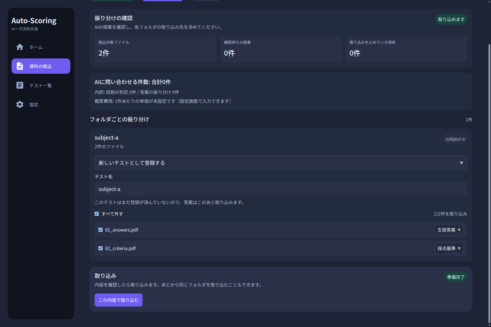
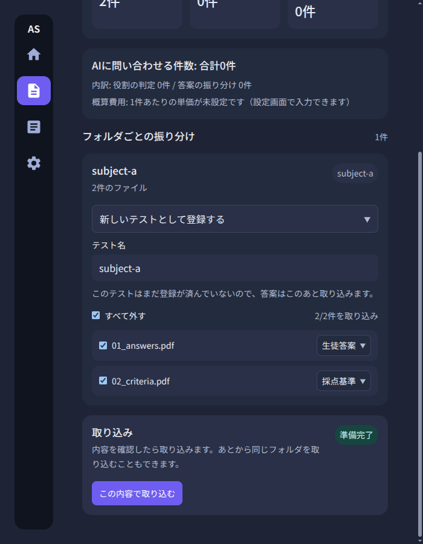
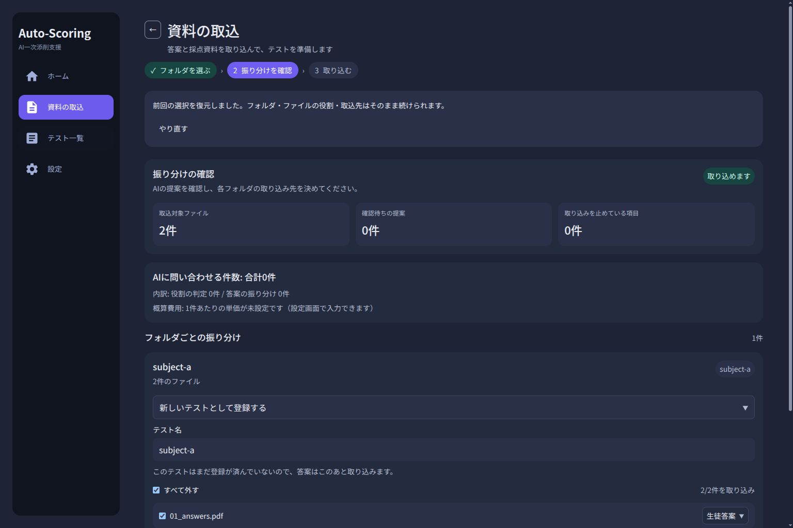
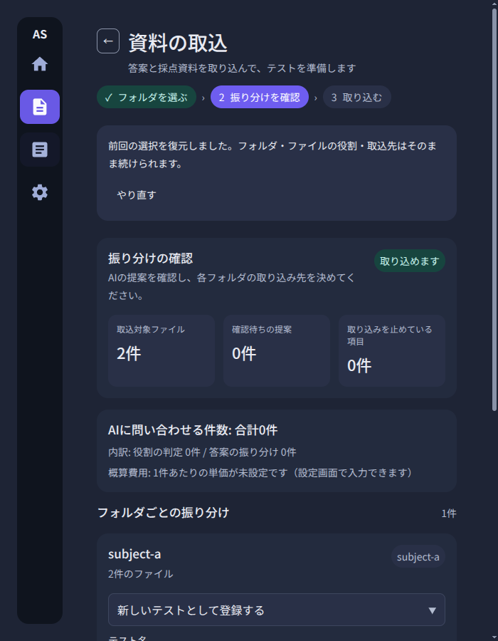
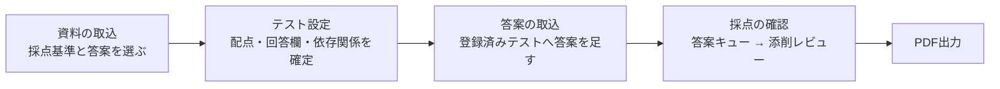
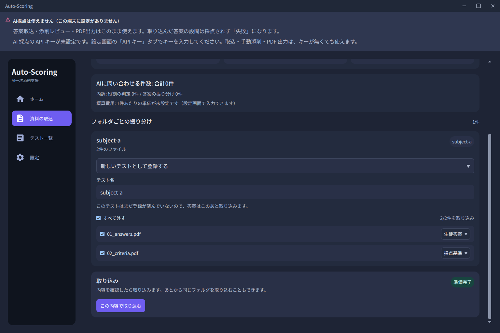
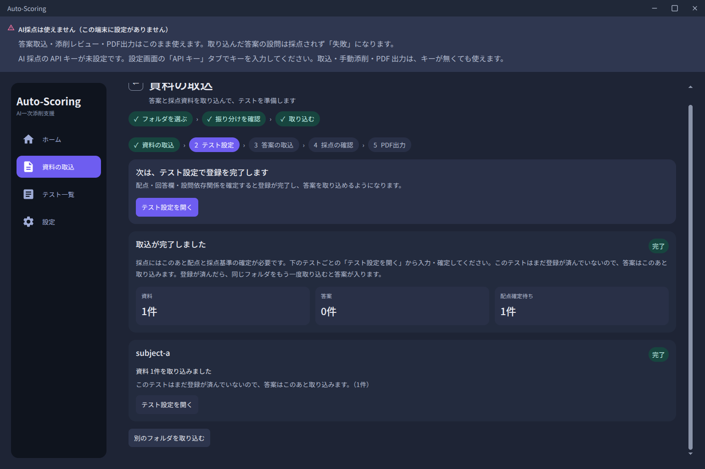
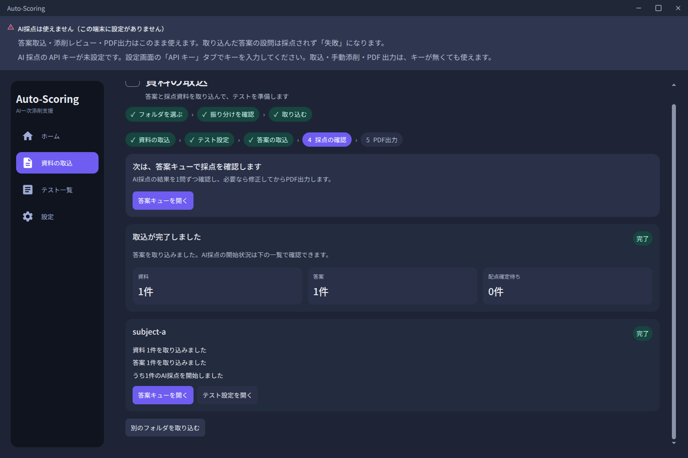
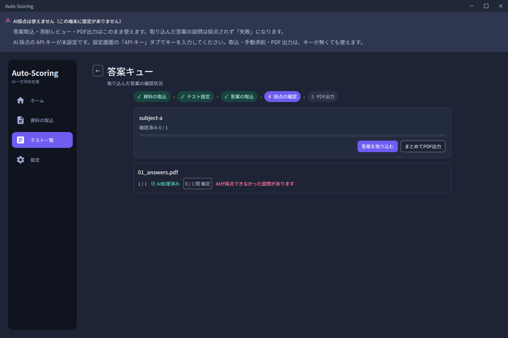
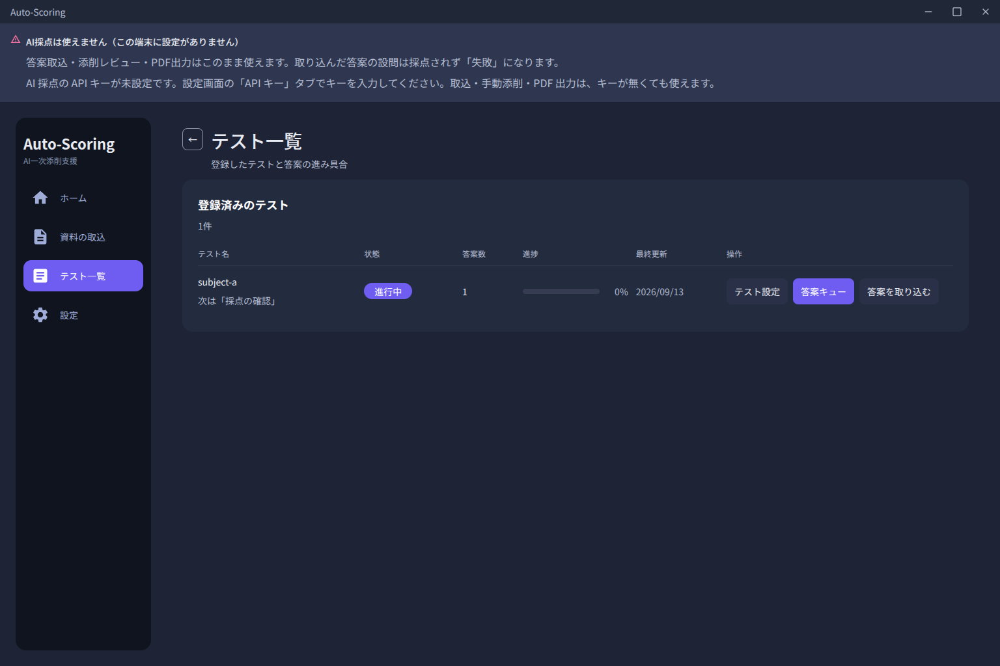

# 資料の取込と設定（Issue #101）

塾から配られた資料フォルダをそのまま取り込む流れと、その振る舞いを決める「取込の型」を記録する。

> **この文書の範囲**
> Issue #101 で新設した画面・設定・API に限る。入力仕様そのものの決定（決定 1〜10）は
> Issue #95 の担当であり、[`simplified-design-specification.md`](./simplified-design-specification.md)
> と [`grading-material-structure.md`](./grading-material-structure.md) に記録される。
> 本書はそれらを前提として、**実装がどうなっているか**を書く。

---

## 1. 何を解決したのか

オーナーが実機で使い、「**実際の形式と合っていないので使い物にならない**」と報告した。
具体的には次の 3 つである。

| 問題                                                   | 直したこと                             |
| ------------------------------------------------------ | -------------------------------------- |
| 画面が**存在しない**模範解答 PDF を要求していた        | 必須入力を**採点基準 PDF だけ**にした  |
| 「テスト登録」と「答案取込」が別画面で、順序が逆だった | **1 画面 3 手**に統合した              |
| 添削資料（Word / Excel）に置き場所が無かった           | 役割つき資料として登録できるようにした |

**直っていないこと**も明記する。取り込んだ時点では**まだ採点できない。**
採点には設問ごとの配点と採点基準が要り、それを採点基準 PDF から取り出す機能は
Issue #101 の範囲外である（Issue #95 決定 A）。取込完了画面はそのことを明示し、
テスト設定画面（人が入力する画面）への導線を出す。

---

## 2. 画面

### 2.1 資料の取込（`/intake`）

**フォルダを選ぶ → 取り込む内容を確認する → 取り込む。**

```text
1. 選ぶ    取込の型を選び、フォルダを1つ選ぶ
              ↓ アプリがフォルダを走査し、名前・サイズ・sha256 だけをサイドカーに送る
2. 確認    ツリーで一覧を見る
              - 取り込み先（新規テスト / 登録済みテスト / 答案ごとに振り分け）
              - ファイルごとの役割（変更できる）・除外（できる）
              - フォルダごとの「すべて取り込む / すべて外す」
                （一部だけならチェックが中間表示。一括の後でも個別チェックで上書きできる）
              - 役割の出所（規則 / AI提案 / 手動 / 未判定）
              - AI に問い合わせる件数と概算費用
              ↓ 規則で決まらなかったファイルだけ AI に問い合わせる（任意）
3. 取込    1件ずつ書き込む。終わったら結果と「次にやること」を出す
```

**確認を省略する設定は無い。** AI の提案を 1 件でも確認していなければ取込ボタンは押せない。
理由は §5。





> **Issue #306 で取込は 2 段になった。** 対象テストが `ready` でないときは資料の取込と
> テスト作成までを行い、**答案は上げない**。登録完了後に同じフォルダをもう一度取り込むと、
> 同名の既存テストを再利用して答案が入り、採点が始まる。段は対象テストの `status` から
> 機械的に決める。順序と再利用規則は
> [`test-registration.md`](./test-registration.md) を参照。

> **Issue #384 で選択は画面を離れても残る。** 「フォルダを選ぶ → 振り分けを確認 → 取込」の
> 途中で別画面（テスト設定・ホーム等）へ移ると `IntakePage` が unmount し、フォルダ・
> ファイル・役割・取込先の選択が全部消えていた。いまはこの選択を**メモリ上のセッション**
> （`desktop/src/renderer/core/intake-data.ts`）に預け、戻ったときに復元する。復元したことは
> 画面に表示し、「やり直す」で捨てられる。保持を捨てるのは、**取込が最後まで成功したとき・
> 利用者が「やり直す」を押したとき・別のフォルダを選び直したとき**。復元の前に選んだ
> フォルダを読み直し、ファイルが消えた・変わっていたときは復元せず、その旨を画面に出す。
> **ディスクには書かない**（再起動をまたいで古い選択が生き残ると、フォルダの現物と選択が
> ずれるため）。





### 2.2 設定（`/settings`）

タブ構成の設定画面を 1 つだけ持つ。Issue #101 では「取込の型」タブのみ。
Issue #96（API キー）は**同じ画面の別タブとして足す**。設定画面を 2 つ作らない。

**ただし保存先は別でよい。** 取込の型は `app-data/settings/intake-templates.json`（平文 JSON）、
API キーは OS の資格情報ストア（Issue #96 の決定）。画面上で隣り合うことは、
同じ場所に置いてよいという意味ではない。

---

## 3. 取込の型

再利用できる規則の並び。**上から順に当てはめ、最初に一致した規則が勝つ。**
だから並び順は意味を持ち、設定画面で並べ替えができる。

| 項目         | 内容                                                                    |
| ------------ | ----------------------------------------------------------------------- |
| 対象         | ファイル名 / フォルダ名                                                 |
| パターン     | `*` と `?` だけのグロブ                                                 |
| 役割         | 生徒答案 / 採点基準 / 添削資料 / 添削サンプル / 参考資料 / 取り込まない |
| 必須度       | 必須 / 推奨 / 任意                                                      |
| フォルダ分割 | 選んだフォルダの直下の各フォルダを、それぞれ別のテストとして取り込むか  |

**フォルダ単位の規則が「40 枚の答案に 40 回クリックさせない」を成立させている。**
`答案` フォルダの中身を全部「生徒答案」とする規則を 1 行書けば、
確認画面ではその 40 件が 1 つのグループとして並び、役割の変更も 1 回で済む。

### 3.1 既定の型

実資料 11 教科で観測した連番規則を既定値とする。
**これは仕様ではなく出発点である。** 命名規則の違う塾は設定画面で置き換える。

| パターン | 役割         | 必須度 |
| -------- | ------------ | ------ |
| `01_*`   | 生徒答案     | 必須   |
| `02_*`   | 採点基準     | 必須   |
| `03*_*`  | 添削資料     | 推奨   |
| `04*_*`  | 添削サンプル | 任意   |
| `*.txt`  | 取り込まない | 任意   |

### 3.2 ファイル名の正規化

実資料には名前の揺れが 7 通りあった。照合の前に、**ファイル名とパターンの両方**を
同じ正規形に落とす（`backend/src/auto_scoring/domain/intake_template.py`）。

| 揺れ                                 | 正規化                                       |
| ------------------------------------ | -------------------------------------------- |
| `04-1_` と `04_1_` の混在            | `-` を `_` に畳む                            |
| `①②③` と `1 2 3` の混在              | NFKC                                         |
| `....pdf.pdf` の二重拡張子           | 同一拡張子の重複だけ畳む（`.tar.gz` は残す） |
| 拡張子の直前の空白                   | 取り除く                                     |
| 役割語のあとの接尾辞                 | 先頭の連番だけで照合するので影響しない       |
| `.txt` の有無                        | 規則で「取り込まない」にする                 |
| **別教科の講座名がついたファイル名** | **教科名を照合に使わない**                   |

最後の 1 つが重要である。ある教科の添削サンプルが別教科の講座名で配られていた。
**名前の教科名は役割の証拠にならない**ので、照合は先頭の連番だけに依存する。

---

## 4. 役割の決め方（3 段構え）

| 段  | 何をするか                                                               | 費用            |
| --- | ------------------------------------------------------------------------ | --------------- |
| 1   | 取込の型の規則で役割を割り当てる                                         | 無料・即時      |
| 2   | 規則が当たらなかったファイルだけ、1 ページ目を AI に見せて役割を推定する | 1 ファイル 1 回 |
| 3   | **人がツリーで確認する**                                                 | —               |

### 4.1 段 2 を呼ばない条件

- 規則が当たったファイル（受入条件 8。テストで固定してある）
- PDF 以外（Word / Excel は 1 ページ目の画像を作れない。**「判定できない」と表示する**）
- 人が既に役割を決めたファイル、除外したファイル
- **一度問い合わせたファイル。** 「判定できなかった」も答えなので、聞き直せば
  同じ返事を同じ値段で買うことになる

同じ内容を前に判定したファイル（sha256 でキャッシュ）は**取りに行く**が、
**無料の別操作**として分けてある（「前回の判定を取得する（N 件・無料）」）。
provider が設定されていない端末でも押せる。支払い済みの判定を、
provider が無いという理由で捨てないため。

### 4.2 帰属判定は、答案のページ全体を答案ごとに送る

**これは知っておくべき代償である。隠さずに書く。**

| 何を                       | いつ                                   | 何が渡るか                                 |
| -------------------------- | -------------------------------------- | ------------------------------------------ |
| 答案の**ページ全体の画像** | 帰属を判定する答案 **1 枚につき 1 回** | ページに書かれているもの。**ヘッダを含む** |

業務ルール §2 (2) の「**版面（レイアウト）を見る**」目的にあたる（2026-09-09 改定）。

**ヘッダを外すことはできない。** 帰属判定が読むのは講座名欄であり、それはヘッダにある。
実資料のヘッダには塾名・校舎名・生徒 ID 欄・生徒氏名欄が同居している
（確認した 3 教科では生徒氏名欄・生徒 ID 欄は空欄、塾名は 3 教科中 1 教科に記入、
講座名は全教科に印字で **1 教科は講師の実名を含む**）。

**「ヘッダを自動で落としてから送る」は作らない。** Issue #99 で案 C として検討し、
版面が塾ごとに変わると破綻するという理由で落としている。
**できないことを、できると書かない。**

#### 送らずに済ませる方法がある

**候補を 1 件に絞れば、1 枚も送らない。**
取込画面の「このフォルダの答案は、どのテストのものですか」で 1 件だけ選ぶと、
帰属は人が決めたことになるので AI を呼ばない。

**週 1 教科ぶんの答案という、いちばん普通の操作がこの経路になる。**
費用が 0 になるだけでなく、**ページ全体の送信も 0 になる。**
画面でもそう案内している。

### 4.3 帰属も、確認するまでは確定しない

役割と同じ規律を帰属にも適用する。AI が返した帰属は **提案**として表示し、人が
確認するまで取り込めない。

**役割の誤りより結果が重いからである。** 帰属は「**どの採点基準で採点されるか**」を
決める。間違えば、別のテストの基準で静かに採点される。役割の誤りは一覧を見れば
分かるが、帰属の誤りは分からない。

ただし**候補を 1 件に絞ったときは提案ではなく確定**である。人が絞ったこと自体が
答えであり、推測は入っていないので確認するものが無い。

### 4.4 答案の帰属は選択問題として問う

「この答案は何の教科か」ではなく「**この答案は、いま候補に挙がっている N 個のテストの
うちどれのものか**」を問う。候補 id の enum を structured output で強制し、
返ってきた値が候補外なら `SchemaViolation` にする。自由文は受け取らない。

**候補集合には登録済みのテストを含める。** 実運用では採点基準が 11 教科ぶんまとめて
1 回配られ、答案は毎週別に届く。2 週目以降は「登録済みのテストに答案だけを足す」ので、
候補が今回のフォルダだけでは合わない。

**そして候補を 1 件に絞ったら AI を呼ばない。** 取込画面で「このフォルダの答案は
どのテストのものか」を絞れるようにしてあり、1 件に絞れば答えは既に決まっている。
1 件から選ばせるために費用を払う理由はない。**これが実際の費用対策の本体であり、
AI 分類は補助である。**

### 4.5 判定できないことは、しばしば正しい答えである

実資料の答案用紙は「講座名(回)」欄が**印字・空欄・手書きの 3 通り**で、
確認した 3 教科すべてで生徒氏名欄・生徒 ID 欄が空欄だった。
**1 ページ目に帰属を示す情報が無い答案が実在する。**

したがって `unknown` は失敗ではなく正しい応答として扱い、「判定できなかった」と
表示して人が選ぶ。**精度は主張しない。**

---

## 5. 確認を省略できないこと

**この分類の精度は測れていない。**
実資料は 1 教科 1 答案であり、「同じテストの別の生徒の答案」が 1 枚も無いため、
精度を主張する根拠が無い。

したがって段 3 を省略する設定を Issue #101 では作らない。
順序を逆にすると、静かに誤ったテストへ紐づいた答案が採点される。
精度を測ったうえで、別 Issue で検討する。

この規則は画面の見た目ではなく**状態として**実装してある
（`app/lib/core/intake_review.dart`）ので、画面を作り直しても規則は残る。
`app/test/intake_review_test.dart` が固定している。

---

## 6. 費用の表示

取込前に**問い合わせ件数**と**概算費用**を表示する（受入条件 7）。

**件数は正確である。費用はそうではない。**
このアプリは provider の料金を知らない。料金は provider・モデル・時期で変わる。
そこで **1 件あたりの単価は利用者が設定画面で入力する**ことにした。
未入力のあいだは「単価が未設定です」と表示し、**数字を出さない。**

`0` と「未設定」は別物として扱う。`0` は「自分の利用は無料だ」という利用者の申告であり、
未設定は「このアプリは知らない」である。0 を表示すると「無料」と読めてしまう。

---

## 7. 失敗しても、成功した分は残る

取込は**一括エンドポイントを使わない。**
確定後は既存の API を 1 件ずつ呼ぶ。

```text
新規テスト     : POST /tests            (採点基準 + 任意の資料)
                 POST /submissions      (答案1枚につき1回)
登録済みテスト : POST /tests/{id}/materials
                 POST /submissions
```

30 枚の 27 枚目で失敗しても、26 枚は残る。再実行は失敗した行だけを対象にする。
同じ内容の再送はサイドカーが sha256 で認識し、二重登録にはならない
（答案は既存の submission を返し、資料は既存の material を返す）。

**取込み 1 回分の取り消しは作っていない。** 代わりに `DELETE /tests/{id}` を用意し、
取込完了画面から 1 クリックで消せるようにした。11 教科を一度に取り込んで全部やり直す
場合は 11 回消すことになる。**ここは手数が減っていない。**

---

## 8. API

| メソッド       | パス                                  | 用途                                                          |
| -------------- | ------------------------------------- | ------------------------------------------------------------- |
| `GET` / `PUT`  | `/intake-templates`                   | 取込の型の読み書き                                            |
| `GET` / `PUT`  | `/intake-cost`                        | AI 判定 1 件あたりの単価（`null` = 未設定）                   |
| `POST`         | `/intake/plan`                        | **バイト列を送らない。** 一覧を送って計画と見積もりを受け取る |
| `GET`          | `/intake/classification-availability` | この端末で AI 判定が使えるか、使えないなら理由                |
| `POST`         | `/intake/classify`                    | **1 リクエスト 1 ファイル。** 役割の提案                      |
| `POST`         | `/intake/attribute`                   | 答案の帰属。候補 2 件以上でのみ受け付ける                     |
| `GET` / `POST` | `/tests/{id}/materials`               | 登録済み資料の一覧・追加                                      |
| `DELETE`       | `/tests/{id}`                         | テストと配下をすべて削除                                      |

`POST /intake/classify` を 1 ファイルずつにしてあるのは、
**進捗表示・部分結果・中止のすべてが普通の HTTP だけで成立する**からである。
SSE も WebSocket も足していない。アプリ側は同時 3 本まで並列に投げる。

---

## 9. 送ってよいもの・出してはいけないもの

- 採点資料・答案を採点 provider へ**送ってよい**（Issue #95 決定 7）
- 送る範囲は**目的の性質**で決まる（業務ルール §2 (2)）。
  **版面を見る目的**（回答欄の検出・**答案の帰属判定**）はページ全体、
  **採点**は回答欄の切り出しのみ。この取込画面が使うのは前者である（§4.2）
- **公開してはいけない。** commit / PR / Issue / docs / CI ログ / スクリーンショット /
  テスト fixture に、実資料の内容（生徒名・答案本文・塾名・講師名・講座名・QR の値）を
  一切出さない
- 送信内容と応答を、ログ・例外メッセージ・記録データセットに残さない（Issue #35 の規律）
- **ファイル名を provider に送らない。** 名前は当てにならないうえ、講座名を含む。
  送るのは 1 ページ目の画像と、このリポジトリが書いた文だけ
- 帰属判定の候補ラベル（テスト名）だけは送る。人が付けた名前であり、
  それが無ければ選択問題が成立しないため

このリポジトリのテスト fixture・スクリーンショットは**すべて合成物**である。

---

## 10. 分かっている制約

| 制約                                         | 理由                                               | 次にどうするか                                     |
| -------------------------------------------- | -------------------------------------------------- | -------------------------------------------------- |
| 取り込んでも採点できない                     | 配点・採点基準の抽出が未実装                       | Issue #95 決定 A で別 Issue                        |
| 自動レイアウト解析には参考資料 PDF が要る    | 版面を模範解答から取っていた実装のまま             | Issue #95 決定 2（答案から回答欄を検出）で別 Issue |
| 答案ごとの振り分け先は**登録済みテストのみ** | 同じ取込で作るテストへの振り分けは作成順に依存する | 教科ごとにフォルダを分ければ済む                   |
| Word / Excel は中身を読まない                | 署名の検査だけを行い、保存している                 | 抽出は別 Issue                                     |
| `codex_app_server` では AI 判定を使えない    | プロトコルに画像入力が無い                         | 他の provider を設定する                           |
| 取込み 1 回分の取り消しが無い                | §7                                                 | テスト単位で削除する                               |

---

## 11. 資料の取込から採点までの順路（Issue #450）

オーナーの依頼（2026-09-12 夜）:

> 資料の取り込み操作がまだわかりにくい。
> 資料の取り込みから実際に採点をするまでの流れがわかりにくく感じる。

§1〜§7 は個々の画面を直してきたが、**画面と画面の間**は繋がっていなかった。
実機で架空データを通しで操作し、次の 2 点で詰まった。**司令官の推定図より、
実物を通した記録のほうを材料にしている。**

| 詰まったところ | 実際に起きていたこと                                                                                                                                        |
| -------------- | ----------------------------------------------------------------------------------------------------------------------------------------------------------- |
| 答案取込の直後 | 完了画面の前向きの導線が各グループの「テスト設定を開く」だけで、**AI採点が始まった答案を見るには「テスト一覧 → 答案キュー」と自力で移動する必要があった**。 |
| 作業中の画面   | 「資料 → 設定 → 答案 → 確認 → 出力」のどこにいるかを示すものが無く、取込画面の 3 段ステッパーは**取込画面の中で完結**していた。                             |

### 11.1 順路（5 段）



この 5 段は `desktop/src/renderer/core/intake-journey.ts` に 1 回だけ定義する。
各画面はここから自分の位置と次の一手を引き、**画面ごとに順路を作り直さない**。

### 11.2 直したこと

- **完了画面の次も自分で進む（`IntakePage`）。** 取込完了に、前向きの
  「次の一手」カードを出す。答案がまだ上げられていない（下書き）ときは
  **「次は、テスト設定で登録を完了します」→ テスト設定へ**。登録済みテストに
  答案を上げて AI 採点が始まったときは
  **「次は、答案キューで採点を確認します」→ 答案キューへ**。グループごとにも
  「答案キューを開く」を出す（`intake-open-queue-*`）。
- **作業中の画面で現在地が見える（`SubmissionQueuePage`）。** 答案キューの上に
  5 段の順路を出し、「採点の確認」を現在として塗る。取込完了画面にも同じ順路を
  出し、**戻らなくても次が分かる**ようにした。
- **一覧から次の 1 手へ直行する（`TestListPage`）。** テストごとに
  「次は「◯◯」」を出し、3 つの操作ボタン（テスト設定 / 答案キュー / 答案を
  取り込む）のうち**現在の段のものだけを主ボタンに上げる**。3 画面を往復せず、
  一覧からそのまま進める。
- **取込画面の文言（`IntakePage`）。** フォルダ選択に「初めての教科はここで
  テストを作り、登録済みのテストに答案を足すときも同じフォルダを選びます」を
  足し、**同じ画面が「テスト作成」と「答案追加」の両方を担う**ことを明示した。

### 11.3 画面（1536x1024）











### 11.4 この Issue で触っていないこと

- **`features/test-settings/`**（配点・回答欄・依存関係の画面）は別 Issue。
  順路には載るが、画面自体は変えていない。
- **`features/settings/`**（使う順番・モデル選択）は別 Issue。
- **`navigation/BackOrHomeButton.tsx` と `ShellScreen.tsx`**（戻るボタンの
  見た目）は別 Issue。順路上「戻らなくて済む」ようにしただけで、ボタンには
  手を入れていない。
- **ホームの「次の一手」**（`core/home-dashboard.ts`）は既存のまま。今回の
  変更は作業中の画面と一覧に足した。
