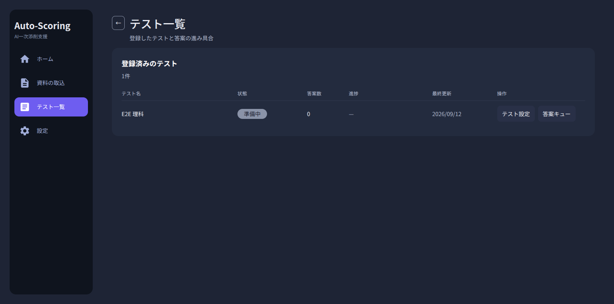
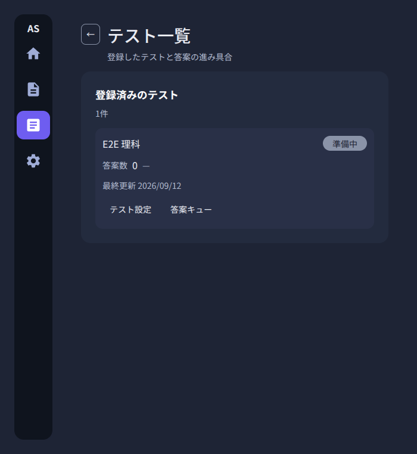

# テスト一覧画面

Issue #379。オーナー報告「資料を取り込んでもテスト一覧に表示されず実際の採点に
進めない」への対応として、`desktop/src/renderer/features/test-list/` に実装した
画面の決定を残す。位置づけは
[simplified-design-specification.md](./simplified-design-specification.md) §16.1、
配色・余白は [design-tokens.md](./design-tokens.md)。

## 0. スクリーンショット

E2E の合成フィクスチャ（`e2e/fixtures/registration-intake`）で作った `draft` の
テストを表示したもの。実在の答案データは写っていない。

1536×1024（表レイアウト）:

700×900（1件1ブロック。表を横スクロールさせない）:

## 1. データ源

**新しいエンドポイントは足していない。** 既存の `GET /test-registrations`
（`backend/src/auto_scoring/api/test_registration_router.py`）が `draft` と
`ready` の両方を返すので、それで足りる。

行の材料（状態ピル・答案数・確認済みの進捗・最終更新）はホームと同じ
`core/home-dashboard.ts` の `HomeTestProgress` / `HomeDashboard` を
`core/home-data.ts` の `loadHomeDashboard` で組む。**同じ数を二か所で別に
定義しない。** そのため `HomeDashboard.tests`（ホームが 8 件で切る前の全件）を
そのまま並べる。

## 2. 画面の状態

| 状態       | 表示                                                               |
| ---------- | ------------------------------------------------------------------ |
| 読み込み中 | `test-list-loading`（`ScreenSkeleton`）                            |
| 失敗       | `test-list-error`（`AppErrorBanner`）＋再試行                      |
| 0 件       | `test-list-empty` の説明と「資料の取込を開く」→ `AppRoutes.intake` |
| 1 件以上   | `test-list-table`。全テストの行（`test-list-row-<id>`）            |

狭幅（`window.innerWidth < 1024`）では 6 列の表を横スクロールさせず、
ホームの `HomeRecentTestsTable` と同じく 1 件 1 ブロックに切り替える。
判定は CSS メディアクエリではなく JS（jsdom が評価しないため、テストから
`resize` で駆動する）。

## 3. 行と遷移

各行は状態ピル（`test-list-status-<id>`、`HomeTestProgress.statusBadge` を
`home-format.ts` の `statusPillClass` で描画）、答案数
（`test-list-answer-<id>` 相当のセル）、確認済みの進捗
（`test-list-progress-<id>` / `test-list-progress-percent-<id>`）、最終更新を持つ。

行から 2 つの入口へ `push` する（積んだスタックを捨てない）。

- テスト設定: `test-list-open-settings-<id>` → `AppRoutes.testSettingsPattern`
- 答案キュー: `test-list-open-queue-<id>` → `AppRoutes.submissionQueuePattern`

`draft` のテストでも両方を出す。答案キューは空になるだけである
（[review-queue.md](./review-queue.md) §8.1 の「draft はキューに入れない」とは
入口の粒度が違い、Issue #379 の受入条件が全行に両方を求めている）。

## 4. ホームとの関係

ホームの「すべて見る」「他N件を見る」とサイドバー「テスト一覧」は
`AppRoutes.testList` へ集まる。ホーム側のコンポーネントは共有化のために
改造していない（Issue #379 の方針）。見た目の一致は `home-format.ts` の
トークン由来ヘルパーとトークンクラスの範囲で取る。
